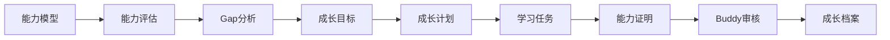

# Team Capability Platform（TCP）

> 基于能力模型的团队能力运营平台（Team Capability Platform）

---

# 1. 项目简介

## 1.1 项目背景

目前团队成员的成长主要依赖：

- 导师经验
- 临时学习安排
- 项目实践
- 年度绩效反馈

存在以下问题：

- 缺少统一的能力标准
- 不同导师评价标准不一致
- 学习目标不清晰
- 学习计划难持续跟踪
- 学习成果无法沉淀
- Leader 难以掌握团队能力建设情况

团队已经建立了《技术架构与开发专业线能力胜任模型》，能够定义不同岗位等级（P4～P8）在各能力域、能力项上的能力要求。

因此，希望建设一套轻量级内部平台，将能力模型数字化，实现团队能力持续运营。

---

## 1.2 产品定位

TCP（Team Capability Platform）不是学习平台。

TCP 是一套：

> **基于能力模型的团队能力运营平台（Capability Operations Platform）。**

平台重点不是：

- 上课程
- 看视频
- 做考试

而是：

> 围绕能力模型持续运营团队能力成长。

---

## 1.3 建设目标

通过平台形成完整能力闭环：

```text
能力模型

↓

能力评估

↓

Gap分析

↓

成长目标

↓

成长计划

↓

学习任务

↓

能力证明

↓

Buddy审核

↓

成长档案

↓

持续提升
```

最终实现：

- 能力标准统一
- 成长路径透明
- 学习过程可跟踪
- 成长成果可验证
- Leader 可运营团队能力

---

# 2. 产品定位

## 产品名称

Team Capability Platform

简称：

TCP

---

## 产品类型

企业内部管理平台

---

## 使用对象

目前：

技术架构与开发团队

未来：

支持多个专业线：

- 产品
- 测试
- 运维
- 数据
- AI
- PM

平台保持统一。

能力模型可扩展。

---

## 建设原则

MVP 优先。

先满足：

一个团队（<10 人）。

后续逐步扩展。

---

# 3. 核心理念

平台遵循以下理念。

---

## 3.1 能力模型驱动

所有成长均来自能力模型。

不是：

课程驱动。

不是：

任务驱动。

而是：

```text
能力模型

↓

能力Gap

↓

成长计划
```

---

## 3.2 能力不是学出来的

课程只是输入。

真正代表能力的是：

Evidence（能力证明）。

例如：

- Demo
- 项目实践
- 技术分享
- 设计方案
- PR
- Code Review
- 技术文章

而不是：

课程完成。

---

## 3.3 Buddy 持续指导

Buddy 不是审批人。

Buddy 更像：

Coach。

职责：

- 指导
- 建议
- Review
- 反馈

帮助成员成长。

---

## 3.4 Leader 做能力运营

Leader 不负责每个人学习。

Leader 负责：

- 能力模型维护
- 学习资源建设
- 团队能力分析
- 年度能力规划

---

# 4. 用户角色

平台支持四类角色。

## Member

团队成员。

负责：

- 自评
- 制定成长计划
- 执行学习任务
- 提交能力证明

---

## Buddy

导师。

负责：

- 指导成员成长
- Review 能力证明
- 提供反馈
- 跟踪成长进度

说明：

一个 Buddy 可以负责多个成员。

---

## Leader

团队负责人。

负责：

- 能力模型维护
- 学习资源维护
- 团队能力分析
- 年度能力规划

Leader 也可以同时是：

- Member
- Buddy

平台采用权限叠加。

---

## Admin

系统管理员。

负责：

- 用户
- 权限
- 参数
- 系统配置

---

# 5. 核心业务闭环

平台围绕一个业务闭环运行。



所有业务都围绕上述流程展开。

---

# 6. 产品能力

平台能力分为四大领域。

---

## Capability

能力管理。

包括：

- 能力模型
- 能力评估
- Gap分析

---

## Growth

成长管理。

包括：

- 成长目标
- 成长计划
- 学习任务
- 成长档案

---

## Mentoring

导师指导。

包括：

- Buddy
- Review
- Feedback

---

## Operations

团队运营。

包括：

- 能力模型维护
- 学习资源维护
- 团队分析
- 数据统计

---

# 7. 文档说明

项目采用 **Docs as Code**。

所有设计文档统一使用 Markdown。

## 文档列表

| 文档 | 说明 |
|------|------|
| README.md | 项目入口 |
| 01_Product.md | 产品定义 |
| 02_Design.md | IA、流程、状态 |
| 03_Data.md | 数据模型 |
| 04_UI.md | 页面设计 |
| 05_Development.md | 开发规范 |
| 06_Roadmap.md | 产品规划 |

---

## 阅读顺序

建议按照以下顺序阅读：

```text
README

↓

01_Product

↓

02_Design

↓

03_Data

↓

04_UI

↓

05_Development

↓

06_Roadmap
```

---

# 8. 技术栈（建议）

| 分类 | 技术 |
|------|------|
| Frontend | React + TypeScript |
| UI | Ant Design Pro |
| Backend | FastAPI |
| ORM | SQLAlchemy |
| Database | PostgreSQL |
| Cache | Redis（预留） |
| Deploy | Docker |
| Reverse Proxy | Nginx |

---

# 9. 开发原则

整个项目遵循以下原则。

## AI First

所有文档均可作为 AI Context。

适用于：

- Claude Code
- Codex
- Cursor
- Trae

---

## Docs as Code

Markdown 为唯一设计源。

所有设计通过 Git 管理。

---

## Single Source of Truth

每项设计只保留一个来源。

禁止多个文档描述同一规则。

---

## MVP First

优先完成：

能够真正投入团队使用。

再逐步优化。

---

# 10. 项目阶段

## Phase 1

MVP

支持：

- 技术架构与开发专业线
- 单团队
- Buddy
- Leader

---

## Phase 2

支持：

多个专业线。

---

## Phase 3

支持：

企业级能力运营。

---

# 11. 当前版本

| 项目 | 内容 |
|------|------|
| Version | v1.0 |
| Status | Design |
| Scope | MVP |
| Team Size | <10 人 |

---

# 12. 文档维护规范

所有文档统一遵循：

- Markdown
- UTF-8
- Mermaid
- Git Version Control

修改原则：

- 优先修改内容
- 不轻易修改文档结构
- 保持文档长期稳定

---

# Appendix

## 名词解释

| 名词 | 说明 |
|------|------|
| Capability Model | 能力模型 |
| Assessment | 能力评估 |
| Gap | 能力差距 |
| Growth Goal | 成长目标 |
| Growth Plan | 成长计划 |
| Learning Task | 学习任务 |
| Evidence | 能力证明 |
| Buddy | 导师 |
| Capability Profile | 成长档案 |

---

**下一份文档：**

> **01_Product.md —— 产品定义（Business Definition）**

---

# 7. 开发环境与工程初始化

当前仓库已完成工程初始化、迭代 2 的只读目录能力以及迭代 3A 的本地会话与演示账号基础，技术基线为 React + TypeScript + Ant Design Pro/ProComponents、FastAPI、PostgreSQL 和 Docker Compose。

- 迭代 2 交付能力模型与学习资源目录的匿名只读展示：启动时由后端镜像内固定 Excel 源导入六个 MVP 域及其目录资料。
- 迭代 3A 交付本地 HttpOnly Cookie 会话、`/login` 登录页、五个本地 UAT 演示账号及 N:M 有效角色与 Buddy 关系基础。

数据库当前包含 catalog 表（`capability_model`、`capability_node`、`learning_resource`、`capability_node_resource`）以及 3A 引入的访问控制表（`tcp_user`、`tcp_role`、`tcp_user_role`、`tcp_session`、`buddy_relationship`）。

## 7.1 前置环境

- Docker Engine 及 Docker Compose v2
- Node.js 22+ 与 npm 10+
- Python 3.12+

## 7.2 一键启动

在项目根目录执行：

```bash
docker compose up --build
```

服务地址：

- 登录页（本地 UAT）：<http://localhost:18081/login>
- 能力模型只读页：<http://localhost:18081/capability/model>
- 学习资源只读页：<http://localhost:18081/operations/resources>
- FastAPI 健康检查：<http://localhost:18001/health>
- FastAPI 数据库就绪检查：<http://localhost:18001/ready>
- PostgreSQL：`localhost:5432`，数据库 `tcp`，用户 `tcp`，开发密码 `tcp_dev_only`

本地 UAT 演示账号（仅在本地开发/UAT 环境有效；密码由部署方配置，仓库不提供默认值）：

| 账号 | 角色 |
|---|---|
| `admin` | Admin、Leader、Member |
| `leader` | Leader、Member |
| `buddy` | Buddy、Member |
| `member` | Member |
| `member2` | Member |

说明：`member` 与 `member2` 的主 Buddy 均为 `buddy`。演示账号仅在 `tcp_user` 为空且已设置 `DEMO_SEED_PASSWORD` 时由种子数据写入，存储前已哈希，不会被记录或返回；生产环境不应启用演示种子。

启用演示种子数据（可选，无仓库默认密码）：

```bash
export DEMO_SEED_PASSWORD='<your strong local value, at least 16 characters>'
docker compose up --build
```

`DEMO_SEED_PASSWORD` 未设置、留空或不足 16 位时跳过种子写入，不创建任何演示账号。密码由部署方自行设定并定期轮换，请勿将真实密码提交到仓库（参考 `backend/.env.example`）。

停止服务：

```bash
docker compose down
```

Compose 创建 PostgreSQL 命名卷；后端仅在 catalog 为空时导入镜像内固定 Excel 源，不提供 HTTP 导入入口。

## 7.2.1 运行回归与重启检查

服务启动后，在项目根目录执行：

```bash
bash scripts/e2e-smoke.sh
```

该检查验证就绪状态、匿名目录、Cookie 登录/登出及 member 的成长档案聚合。脚本要求 `TCP_E2E_DEMO_PASSWORD` 与启动时设置的 `DEMO_SEED_PASSWORD` 一致；未设置时脚本直接失败。若要验证后端和前端容器重启后的数据保留与就绪状态：

```bash
TCP_E2E_RESTART=1 bash scripts/e2e-smoke.sh
```

运行日志查看：

```bash
docker compose logs --tail=100 backend frontend
```

## 7.3 本地运行

前端：

```bash
cd frontend
npm install
npm run dev
```

后端：

```bash
cd backend
python3 -m venv .venv
. .venv/bin/activate
pip install -r requirements-dev.txt
uvicorn app.main:app --reload --port 8000
```

后端环境变量可参考 `backend/.env.example`；本地 PostgreSQL 连接使用 `DATABASE_URL`，默认端口为 `8000`。

## 7.4 质量检查

```bash
cd frontend
npm run lint
npm run format:check
npm run build

cd ../backend
ruff check .
black --check .
pytest
```

## 7.5 当前交付边界

已交付能力：

- 匿名只读页面 `/capability/model`、`/operations/resources` 与对应只读 API `GET /api/capability-model`、`GET /api/learning-resources`、`GET /api/learning-resources/{material_code}`。
- 本地会话与认证：`/login` 页面、`POST /api/auth/login`、`POST /api/auth/logout`、`GET /api/auth/me`；使用 HttpOnly Cookie，无 localStorage/token。
- 五个本地 UAT 演示账号（密码由部署方通过 `DEMO_SEED_PASSWORD` 配置）及其 N:M 角色、Buddy 关系，仅在本地开发/UAT 有效。
- 健康检查 `/health` 与 `/ready`。

当前不含 Assessment、Assessment Review、Gap、Growth Goal、Annual Growth Plan、Plan Item、Learning Task、Evidence、Buddy Review、Capability Profile、Admin 管理页、SSO、注册、密码重置或任何其他业务写入功能。业务对象、权限、路由、状态和原型绑定以 `docs/01_Product.md` 至 `docs/05_Development.md` 为准，后续能力仍须按门禁实施。
