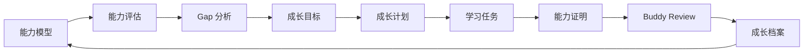
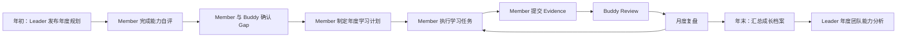

# 01 Product

## 1. 产品定位

### 1.1 产品定义

Team Capability Platform（简称 TCP）是一套**基于能力模型的团队能力运营平台（Capability Operations Platform）**。

TCP 不是：

- 学习平台（LMS）
- 考试平台
- 课程管理平台
- 绩效系统

TCP 的核心是：

> 围绕能力模型持续运营团队能力成长。

### 1.2 产品目标

通过平台形成完整能力闭环：

```text
能力模型 → 能力评估 → Gap 分析 → 成长目标 → 成长计划
  → 学习任务 → 能力证明 → Buddy Review → 成长档案 → 持续提升
```

最终实现：

- 能力标准统一
- 成长路径透明
- 学习过程可跟踪
- 成长成果可验证
- Leader 可运营团队能力

### 1.3 产品边界

| 范围 | 说明 |
|---|---|
| 当前使用对象 | 技术架构与开发团队 |
| 未来扩展 | 产品、测试、运维、数据、AI、PM 等专业线 |
| 团队规模 | MVP 阶段优先支持一个团队（< 10 人） |
| 专业线 | 首期以「技术架构与开发专业线」为试点 |
| 能力模型来源 | 以现有能力胜任模型 Excel 与学习计划模板 Excel 为业务来源 |

平台保持统一，能力模型可扩展；不同专业线复用同一套能力运营机制。

---

## 2. 用户角色

平台固定四类角色，权限可叠加。

### 2.1 Member（团队成员）

- 查看能力模型与个人能力要求。
- 完成能力自评。
- 基于 Gap 制定成长目标与年度学习计划。
- 执行学习任务并提交能力证明。
- 查看个人成长档案。

用户与角色为 N:M 关系；同一用户可拥有多个固定角色，权限按角色叠加生效。

### 2.2 Buddy（导师）

- 指导所负责成员的成长。
- Review 成员提交的能力证明。
- 提供反馈与改进建议。
- 跟踪成员成长进度。

说明：一个 Buddy 可以负责多个成员。

### 2.3 Leader（团队负责人）

- 维护能力模型。
- 维护学习资源。
- 进行团队能力分析。
- 制定年度能力规划。

Leader 可同时是 Member 或 Buddy，平台采用权限叠加。

### 2.4 Admin（系统管理员）

- 管理用户。
- 管理权限。
- 维护系统参数与配置。

---

## 3. 核心业务闭环



各阶段职责：

| 阶段 | 主要执行者 | 输出 |
|---|---|---|
| 能力模型 | Leader / Admin | 能力域、能力项、等级要求 |
| 能力评估 | Member | 当前掌握度、目标掌握度 |
| Gap 分析 | Member / Buddy | 差距项、优先级 |
| 成长目标 | Member / Buddy | 年度补齐目标 |
| 成长计划 | Member | 年度学习计划 |
| 学习任务 | Member | 执行记录、证据 |
| 能力证明 | Member | Demo、文档、PR、Code Review、技术文章等 |
| Buddy Review | Buddy | Review 结论、反馈 |
| 成长档案 | 平台汇总 | 个人完整成长记录 |

---

## 4. 能力模型

### 4.1 能力结构

能力模型由一级能力域、二级能力项、三级能力项构成。

- **三级能力项**是计划与跟踪的最小单元。
- 能力结构整体权重为：专业能力 70%，通用素质能力 30%。
- 专业能力内部暂不拆分权重。
- MVP 阶段不计算综合总分；70% / 30% 仅作为规划口径，用于团队能力分析与年度规划参考。

### 4.2 岗位等级

岗位等级覆盖 P4～P8：

| 等级 | 定位 |
|---|---|
| P4 | 执行型工程师 |
| P5 | 独立工程师 |
| P6 | 高级工程师 / 模块负责人 |
| P7 | 架构师 / 复杂项目负责人 |
| P8 | 专家 / 领域负责人 |

### 4.3 能力域

一级能力域分为专业能力域与通用素质能力域。

**MVP 启用域（共 6 个）：**

| 编码 | 能力域 | 类型 | MVP 状态 |
|---|---|---|---|
| P01 | Data Infra 能力 | 专业能力域 | 启用 |
| P02 | AI Infra / Agent 能力 | 专业能力域 | 启用 |
| P03 | Coding 能力 | 专业能力域 | 启用 |
| C01 | 基本办公能力 | 通用素质能力域 | 启用 |
| C02 | 沟通协作 | 通用素质能力域 | 启用 |
| C03 | 学习创新 | 通用素质能力域 | 启用 |

**未来扩展域（共 3 个）：**

| 编码 | 能力域 | MVP 状态 |
|---|---|---|
| - | 架构与工程能力 | 保留扩展位 |
| - | 咨询与方案能力 | 保留扩展位 |
| - | DevOps 与稳定性能力 | 保留扩展位 |

未来扩展域规则：

- MVP 阶段不导入有效 L3 项。
- 不参与自评、Gap 分析、成长目标、年度成长计划、学习任务、Evidence Review 与团队分析。
- 不在 MVP 页面中作为可操作能力域展示；仅在能力模型中以扩展占位形式保留结构。

### 4.4 掌握度评分标准

| 掌握度 | 说明 | 职级参考 |
|---|---|---|
| 0 | 未接触 / 不具备可验证输出 | - |
| 1 | 了解概念，需要他人指导或协助 | 入门 |
| 2 | 标准场景可独立执行，有基础实操输出 | P4 |
| 3 | 能处理常见问题，能闭环基础异常 | P5 |
| 4 | 能设计方案、组织实施并处理复杂场景 | P6 |
| 5 | 能主导复杂项目，沉淀规范、模板和方法论 | P7-P8 |

---

## 5. 能力评估

### 5.1 评估对象

以三级能力项为最小评估单元，Member 对每一项进行自评。

### 5.2 评估触发条件

- **年度评估**：每年初或年度规划启动时，Member 需完成一次全面自评。
- **年中复核**：Member 可在执行过程中更新当前掌握度，但需保留历史版本，便于追溯成长轨迹。
- **晋升 / 转岗前评估**：Member 在申请晋升或转岗前，可主动发起一次全面复核。

### 5.3 自评流程

1. Member 进入能力自评页面，按一级能力域逐层展开三级能力项。
2. 对每项能力，Member 选择当前掌握度（0～5）。
3. Member 填写自评依据，包括：可验证输出、完成场景、参考材料或备注。
4. 系统按 Member 目标职级、能力适用范围和 Leader 覆盖生成只读标准目标。
5. 确有个性化需要时，Member 可对已适用能力项申请调整目标，并填写调整值与原因。
6. 全部适用能力项评估完成后，Member 提交自评结果。
7. 提交后的自评进入「待复核」状态，Buddy 可查看标准目标、个人调整及原因并进行复核。

### 5.4 目标等级确定

- 标准目标由能力模型统一确定，Member 与 Buddy 不得修改能力模型标准。
- 默认映射为：P4=2、P5=3、P6=4、P7=5、P8=5。
- `recommended_start_level` 决定 L3 的最早适用职级；支持 P4～P8 单职级及使用 `-`、`–`、`—` 的范围。无法安全解析时必须记录并明确提示，不得静默生成目标。
- 适用范围优先：Member 目标职级低于最早适用职级时，标准目标为「不适用」，不参与 Gap，也不能成为计划候选。
- Leader 可对已进入适用范围的 L3 × P4～P8 设置 1～5 或「不适用」覆盖；低于最早适用职级的覆盖无效并必须被服务端拒绝。提前适用只能先修改 `recommended_start_level`。
- 未设置覆盖时使用默认映射；设置数值时使用覆盖值；明确设置「不适用」时该职级不参与 Gap 和计划。
- Member 只能在标准目标已适用时申请个人调整。调整值必须为 1～5，原因不能为空；标准目标为「不适用」时不得通过个人调整改变适用范围。
- 最终有效目标为：合法个人调整值优先，否则取标准目标。Buddy 可通过既有「认可 / 建议调整」结论给出反馈，不新增审批流。

### 5.5 评分规则

- 掌握度采用 0～5 分制，对应说明见「4.4 掌握度评分标准」。
- 自评结果需有可验证输出作为支撑。
- 掌握度 0 表示未接触或不具备可验证输出；不建议将「仅看过材料」评定为 2 及以上。
- 当前掌握度可低于、等于或高于当前职级基准，平台记录但不强制限制。

### 5.6 Buddy 复核

- Member 提交自评后，Buddy 可查看负责成员的自评结果。
- Buddy 复核内容：当前掌握度是否合理、目标掌握度是否合适、自评依据是否充分。
- Buddy 可给出复核结论：
  - **认可**：自评结果有效，完成本次自评复核闭环。
  - **建议调整**：Buddy 给出具体调整建议，Member 修改后重新提交。
- 复核结论不影响 Member 查看 Gap 与设置优先级；正式将 Gap 纳入年度成长计划（包括生成年度成长计划及其计划项）的统一门禁：当前 Assessment 最新一次提交对应的 Assessment Review 已闭环，Review 结论为「认可」，且不存在待复核事项。

### 5.7 评估周期

- 年度评估：每年初或年度规划启动时完成一次全面自评。
- 年中复核：Member 可在需要时更新当前掌握度，但需保持评估历史可追溯。

### 5.8 评估历史

- 平台保留每次评估的完整快照，包括评估时间、当前掌握度、当时的标准目标、是否个人调整、调整值与原因、最终有效目标、自评依据、Buddy 复核结论。
- Assessment 创建后，能力模型、Leader 覆盖或 Member 目标职级变化不得改写该次快照。
- Member 可查看个人能力成长曲线。

---

## 6. Gap 分析

### 6.1 Gap 计算方式

Gap = 服务端确认的最终有效目标 - 当前掌握度。

标准目标为「不适用」的能力项，以及被 Leader 明确覆盖为「不适用」的能力项，不计算 Gap、不生成 Gap 记录、不能成为计划候选。

当 Gap > 0 时，该项被识别为需要补齐的能力项。

Gap 在 Member 提交自评后立即生成；Member 无需等待 Buddy 复核即可查看 Gap、设置优先级。正式将 Gap 纳入年度成长计划（包括生成年度成长计划及其计划项）的统一门禁：当前 Assessment 最新一次提交对应的 Assessment Review 已闭环，Review 结论为「认可」，且不存在待复核事项。Buddy 的复核结论作为反馈与历史记录。

Gap 值越大，表示该项需要提升的幅度越大。

### 6.2 Gap 分级

按 Gap 值对能力项进行分级：

| Gap 值 | 分级 | 说明 |
|---|---|---|
| 0 | 无差距 | 当前掌握度已达到目标 |
| 1 | 小差距 | 需小幅提升 |
| 2 | 中等差距 | 需系统学习与实操 |
| 3 | 较大差距 | 需较长时间投入 |
| 4 | 大差距 | 需重点突破 |
| 5 | 极大差距 | 需长期规划 |

### 6.3 优先级定义

Member 对 Gap 项设置优先级，参考选项：

| 优先级 | 定义 |
|---|---|
| 高 | 对当前岗位或年度目标影响大，建议优先补齐 |
| 中 | 对当前岗位有帮助，可在高优先级之后安排 |
| 低 | 提升空间存在，但紧迫性较低 |
| 暂缓 | 当前年度不纳入计划，后续再评估 |

优先级设置参考因素：

- 岗位当前职责需要。
- 年度团队能力规划重点。
- Buddy 建议。
- 学习材料与实操环境可获取性。

### 6.4 纳入计划规则

- Member 将 Gap > 0 的项标记为「是否纳入计划 = 是」，形成年度需要补齐的能力范围。
- 高优先级项建议默认纳入计划。
- 暂缓项不纳入计划，但保留在 Gap 列表中供后续参考。
- 纳入计划的能力项自动进入成长计划候选清单。
- 正式将 Gap 纳入年度成长计划（包括生成年度成长计划及其计划项）的统一门禁：当前 Assessment 最新一次提交对应的 Assessment Review 已闭环，Review 结论为「认可」，且不存在待复核事项。

---

## 7. 成长计划

### 7.1 计划来源

成长计划从已纳入计划的 Gap 项自动生成清单，Member 补充计划信息。

正式将 Gap 纳入年度成长计划（包括生成年度成长计划及其计划项）的统一门禁：当前 Assessment 最新一次提交对应的 Assessment Review 已闭环，Review 结论为「认可」，且不存在待复核事项。

### 7.2 能力项与学习任务关系

- 一个纳入计划的三级能力项对应一个学习计划项。
- 一个学习计划项生成一个学习任务。
- MVP 阶段一个学习任务不再拆分子任务。
- 一个学习任务可关联一个或多个 Evidence。

关系示意：

```text
三级能力项（Gap） → 学习计划项 → 学习任务 → Evidence（1 个或多个）
```

### 7.3 任务拆解规则

- MVP 阶段一个计划项对应一个学习任务，学习任务不再拆分子任务。
- 学习任务的执行内容即三级能力项对应的学习任务 / 实操内容。
- 如 Member 需要个人拆分执行步骤，可在复盘或备注中记录，但平台不维护子任务。

### 7.4 计划信息

每个计划项包含：

- 能力编码
- 三级能力项
- 当前掌握度
- 目标掌握度
- 差距
- 优先级
- 学习材料
- 学习任务 / 实操内容
- 预期输出 / 验收方式
- 预计耗时
- 计划开始日期
- 计划截止日期
- 目标月份
- 状态

### 7.5 计划周期

默认年度计划周期为 12 个月。

### 7.6 计划状态

参考状态选项：

| 状态 | 说明 |
|---|---|
| 未开始 | 计划已生成，尚未开始执行 |
| 进行中 | 已开始执行，尚未提交 Evidence |
| 已完成 | 已提交 Evidence 并通过完成判定 |
| 延期 | 未在计划截止日期前完成 |
| 暂停 | 临时中止，后续可恢复 |
| 取消 | 不再执行，需说明原因 |

### 7.7 计划调整

- 先尽量固定年度能力范围与计划清单，再进入执行跟踪。
- 中途如大幅调整 Gap 入选范围，需复核执行跟踪中的手填状态和证据是否仍对应正确能力项。
- 计划截止日期、目标月份可由 Member 调整，但调整原因建议记录。

---

## 8. 学习任务

### 8.1 任务来源

学习任务由成长计划中的计划项生成，一个计划项对应一个学习任务，不再拆分更细任务。

### 8.2 执行跟踪

Member 在学习任务中维护：

- 执行状态
- 实际开始日期
- 实际完成日期
- 实际耗时
- 证据链接 / 文件
- 完成质量
- 复盘结论
- 下步动作

Member 可在学习任务下记录 **Learning Progress Log（学习执行日志）**，字段固定为：`task_id`、`record_date`、`actual_hours`、`note`、`recorder`。每条日志只关联一个 Learning Task，用于学习时长聚合；日志不拆分任务，不改变一个 Plan Item 对应一个 Learning Task 的关系。Member 可维护本人日志，Buddy、Leader 按数据范围查看。

### 8.3 完成判定

一条学习任务建议同时满足以下条件方可判定为完成：

- 状态为「已完成」。
- 有证据链接或文件说明。
- 有复盘结论。
- 如未产出可检查材料，不建议判定为完成。

### 8.4 月度复盘

按月查看：

- 计划项数
- 已完成数
- 完成率
- 预计耗时
- 实际耗时
- 主要产出
- 主要问题
- 下月重点

月度与年度学习时长均从 Learning Progress Log 的 `actual_hours` 按 `record_date` 聚合；该日志仅用于时长归集，不产生新的计划或任务状态。

---

## 9. 学习成果（Evidence）

### 9.1 Evidence 定义

Evidence 是代表能力成长的可验证输出，而不是课程完成。

可接受的 Evidence 类型包括：

- Demo
- 项目实践
- 技术分享
- 设计方案
- PR
- Code Review
- 技术文章
- 部署文档
- 验证报告
- 复盘材料

### 9.2 Evidence 与能力域对应关系

不同能力域、不同职级对应的 Evidence 样例不同，参考如下：

| 能力域 | P4 样例 | P5 样例 | P6 样例 |
|---|---|---|---|
| Data Infra 能力 | 安装部署大赛训练记录；环境检查清单；基础部署文档 | 独立部署记录；常见问题排查单；TDS / ArgoDB 基础配置记录 | 平台规划方案；性能验证报告；治理工程化方案 |
| AI Infra / Agent 能力 | AI Coding 学习记录；Prompt / RAG 基础实验；问数体验报告 | 简单 RAG / 问数 / Agent POC；脚本或接口调用样例 | 知识库构建方案；Agent 编排方案；效果评估记录 |
| Coding 能力 | SQL / Python / 脚本练习；AI 生成代码评审记录 | 可运行脚本、接口或 POC；Git 提交记录；单元测试 | 模块设计与代码实现；TDD 用例；重构记录 |

P7、P8 样例参考详细证据样例表。

### 9.3 Evidence 提交

- 每个学习任务可关联一个或多个 Evidence。
- Evidence 需说明对应能力项、完成内容、验证方式。
- Evidence 支持链接或文件说明两种形式。
- Evidence 提交后进入「待 Review」状态。

### 9.4 Evidence 验证

- MVP 阶段 Buddy 是 Evidence 的唯一 Review 执行者。
- Buddy 查看 Evidence 并给出 Review 结论：
  - **通过**：Evidence 充分证明目标能力已达成，学习任务可标记为已完成。
  - **需补充**：Evidence 不足以证明，Buddy 给出补充要求，Member 完善后重新提交。
- Leader 可查看团队 Evidence 用于分析，但不直接 Review Evidence。

### 9.5 Evidence 驳回

- 当 Evidence 明显不符合能力项要求、无法验证或与学习任务不相关时，Buddy 可驳回。
- 驳回需填写原因，Member 可查看后重新准备 Evidence 并再次提交。
- 驳回不影响学习任务的重新执行，Member 可在补充学习后再次提交。

### 9.6 Evidence 历史记录

- 平台保留同一学习任务下的所有 Evidence 提交记录，包括提交时间、Review 结论、Review 意见、Review 人。
- Member 可查看每次提交的版本差异。
- 通过的 Evidence 进入成长档案，按年度归档保留。

### 9.7 Evidence 完成判定

一条学习任务建议同时满足以下条件方可判定为完成：

- 状态为「已完成」。
- 有证据链接或文件说明。
- 有复盘结论。
- 如未产出可检查材料，不建议判定为完成。

### 9.8 Evidence 提交要求

- Evidence 必须对应到具体能力项。
- Evidence 是可验证输出，不是课程完成记录。
- 未产出可检查材料的学习任务不建议判定为完成。

---

## 10. Buddy 协作机制

### 10.1 Buddy 分配

- MVP 阶段每个 Member 仅有 1 名主 Buddy。
- 一个 Buddy 可负责多个 Member。

### 10.2 Buddy 职责

- 指导成员识别 Gap 与制定计划。
- Review 成员提交的能力证明。
- 提供反馈、改进建议与风险提醒。
- 跟踪成员年度成长进度。

### 10.3 Buddy 不是审批人

Buddy 更像 Coach，职责是指导、建议、Review、反馈，而非单纯审批通过或拒绝。

### 10.4 Review 流程

1. Member 提交 Evidence。
2. Buddy 查看 Evidence 并给出 Review 结论与反馈。
3. 如需补充，Member 完善后重新提交。
4. 认可通过的 Evidence 进入成长档案。

---

## 11. Leader 管理机制

### 11.1 能力模型维护

Leader 负责维护：

- 能力域定义
- 能力项描述
- 各职级能力要求
- L3 在 P4～P8 的标准目标覆盖（使用默认 / 指定 1～5 / 不适用）
- 学习材料关联

低于 L3 `recommended_start_level` 的职级覆盖不可维护。如需提前适用，Leader 必须先调整建议起始职级。

### 11.2 学习资源维护

Leader 负责维护学习资源库，包括：

- 材料编码
- 材料名称
- 材料类型
- 材料来源 / 附件
- 用途说明
- 材料状态

### 11.3 团队能力分析

Leader 可查看：

- 团队成员能力分布
- 各能力域达标情况
- Gap 集中领域
- 计划完成率
- 实际耗时统计

### 11.4 年度能力规划

Leader 基于团队能力分析结果，制定下一年度团队能力建设的重点方向与资源投入计划。

---

## 12. 年度运营流程

### 12.1 总体流程



### 12.2 阶段说明

| 阶段 | 时间 | 关键动作 | 主要角色 |
|---|---|---|---|
| 年度规划 | 年初 | Leader 发布能力运营重点与资源安排 | Leader |
| 能力自评 | 年初 | Member 完成当前掌握度与目标掌握度评估 | Member |
| Buddy 复核 | 年初 | Buddy 复核 Member 自评结果 | Buddy |
| Gap 确认 | 年初 | Member 与 Buddy 一起确认需补齐的能力项 | Member / Buddy |
| 计划制定 | 年初 | Member 形成年度学习计划 | Member |
| 执行跟踪 | 全年 | Member 执行学习任务、提交 Evidence、Buddy Review | Member / Buddy |
| 月度复盘 | 每月 | 查看计划数、完成数、完成率、耗时与问题 | Member / Buddy / Leader |
| 年末汇总 | 年末 | 平台自动生成成长档案，Leader 进行团队能力分析 | Leader / 平台 |

### 12.3 年初启动规则

1. Leader 在年初发布年度能力运营规划，明确本年度团队能力建设的重点能力域。
2. 平台开启新一轮年度评估窗口，Member 首页收到自评提醒。
3. Member 在规定周期内完成自评并提交。
4. Buddy 在自评提交后完成复核。
5. 正式将 Gap 纳入年度成长计划（包括生成年度成长计划及其计划项）的统一门禁：当前 Assessment 最新一次提交对应的 Assessment Review 已闭环，Review 结论为「认可」，且不存在待复核事项。通过门禁后，Member 根据 Gap 分析与 Buddy 建议制定年度学习计划。

### 12.4 年中执行规则

1. Member 按月度节奏推进学习计划。
2. Member 完成学习任务后提交 Evidence。
3. Buddy 在收到 Evidence 后进行 Review，给出通过、需补充或驳回结论。
4. 每月末 Member 查看月度复盘数据，调整下月执行重点。

### 12.5 年末收尾规则

1. 平台自动汇总 Member 全年通过的 Evidence、已完成的学习任务与成长数据，生成成长档案。
2. Leader 查看团队能力分析，识别团队整体 Gap 与下一年度重点。
3. Leader 基于分析结果制定下一年度能力规划。

### 12.6 跨年度数据规则

- 评估历史、Evidence 记录、成长档案按年度保存，支持跨年查看。
- 新年度自评开始时，上一年度的目标掌握度可作为参考基线。
- 未完成的计划项可选择延续到下一年度或取消。

---

## 13. 业务规则

### 13.1 能力模型规则

- 能力模型是平台唯一的能力标准来源。
- 所有成长目标、学习计划、学习任务均来自能力模型中的能力项。
- 三级能力项是计划与跟踪的最小单元。
- L3 的建议起始职级优先决定适用范围；Leader 覆盖不能隐式扩大适用范围。

### 13.2 评估规则

- 掌握度采用 0～5 分制。
- 自评需有可验证输出支撑。
- 标准目标由系统生成并随 Assessment 保存快照，Member 请求不得直接提交标准目标或最终有效目标。
- 个人调整仅适用于已适用能力项，必须同时包含 1～5 的调整值和非空原因。
- Buddy 可对 Member 自评进行复核。

### 13.3 计划规则

- 成长计划从已纳入计划的 Gap 项自动生成。
- 计划周期默认为 12 个月。
- 学习计划建议包含：状态为「已完成」、证据链接或文件说明、复盘结论。

### 13.4 Evidence 规则

- Evidence 必须对应到具体能力项。
- Evidence 是可验证输出，不是课程完成记录。
- 未产出可检查材料的学习任务不建议判定为完成。

### 13.5 Buddy 规则

- Buddy 负责指导、Review、反馈，不是审批人。
- MVP 阶段每个 Member 仅有 1 名主 Buddy；一个 Buddy 可负责多个成员。

### 13.6 Leader 规则

- Leader 负责能力模型、学习资源、团队分析、年度规划。
- Leader 不直接负责每个人的学习执行。

---

## 14. 权限原则

### 14.1 角色权限矩阵

| 功能 | Member | Buddy | Leader | Admin |
|---|---|---|---|---|
| 查看能力模型 | ✓ | ✓ | ✓ | ✓ |
| 维护能力模型 | - | - | ✓ | - |
| 维护学习资源 | - | - | ✓ | - |
| 完成自评 | ✓ | - | - | - |
| 查看他人自评 | - | ✓（负责成员） | ✓（团队） | ✓ |
| 制定成长计划 | ✓ | - | - | - |
| Review Evidence | - | ✓（负责成员） | - | - |
| 查看团队 Evidence | - | ✓（负责成员） | ✓ | ✓ |
| 查看团队分析 | - | - | ✓ | ✓ |
| 用户 / 权限管理 | - | - | - | ✓ |

### 14.2 权限叠加

- Leader 可同时拥有 Member 和 Buddy 的权限。
- Admin 拥有系统管理权限及全量数据查看权限；自评、计划维护、自评复核、Evidence Review 等业务操作权限按 Member、Buddy、Leader 角色叠加。

### 14.3 数据可见性

- Member 只能查看自己的评估、计划、任务、Evidence、成长档案。
- Buddy 可查看自己负责成员的相关数据。
- Leader 可查看整个团队的相关数据。
- Admin 可查看全部数据。

---

## 15. MVP 范围

### 15.1 边界假设

- **团队规模**：MVP 优先支持一个团队，人数不超过 10 人。
- **专业线范围**：首期以「技术架构与开发专业线」为试点。
- **部署形态**：私有化单实例部署，不追求多租户隔离。
- **数据初始状态**：能力模型、三级能力项、学习资源由 Leader / Admin 初始化导入，Member 不自行创建能力项。
- **用户账号**：MVP 阶段先支持平台内置账号与基础权限，不与外部 IAM / SSO 深度集成。

### 15.2 包含范围

| 模块 | MVP 内范围 |
|---|---|
| 用户与权限 | 四类角色账号创建、角色分配、权限叠加。 |
| 能力模型 | 管理一级能力域、二级能力项、三级能力项；维护每个能力项的 P4～P8 等级描述；导入导出能力模型。 |
| 能力评估 | Member 自评当前掌握度与目标掌握度；Buddy 复核；保留评估历史。 |
| Gap 分析 | 按三级能力项计算 Gap；Gap 分级与优先级排序；生成建议补齐清单。 |
| 成长计划 | Member 基于 Gap 制定年度学习计划；计划按三级能力项展开；一个计划项对应一个学习任务。 |
| 学习任务 | 任务创建、状态跟踪、完成确认；任务与计划项、Evidence 关联。 |
| Evidence | 提交链接或文件；Buddy Review；通过 / 需补充 / 驳回状态；历史记录。 |
| Buddy Review | Buddy 对 Evidence 进行 Review 并填写反馈；被驳回后可重新提交。 |
| 成长档案 | 汇总个人评估、计划、任务、Evidence 与成长轨迹；支持按年度查看。 |
| 团队分析 | Leader 查看团队整体 Gap 分布、计划完成率、Evidence 通过率等基础指标。 |
| 年度运营 | 支持年初规划、年中执行、年末汇总的完整年度流程。 |

### 15.3 不包含范围

| 模块 | MVP 外范围 | 说明 |
|---|---|---|
| 多专业线能力模型 | 产品、测试、运维、数据、AI、PM 等专业线 | 保留数据结构扩展能力，首期不实现。 |
| 多团队 / 企业级 | 跨团队能力对比、企业级人才盘点 | 仅支持单团队内部运营。 |
| 系统集成 | 与 LMS、绩效、HR、SSO、IM、邮件等系统对接 | MVP 不建设独立消息中心；待办、到期、逾期提醒仅在首页展示。 |
| 晋升评审工作流 | 正式的晋升申请、评审委员会、评分表决 | 平台提供成长数据支撑，评审流程本身不在 MVP 内。 |
| 培训资源管理 | 课程、学时、讲师、教材、认证标准 | 仅维护学习资源索引与链接，不管理课程全生命周期。 |
| 复杂算法 | AI 推荐学习路径、智能匹配 Buddy、自动评估 | 由 Member / Buddy / Leader 人工决策。 |
| 移动端 | 手机 App 或小程序 | 仅支持 Web 端访问。 |
| 实时协同 | 多人同时编辑同一份评估或计划 | Assessment 使用单调 revision 的乐观并发控制；过期写入返回冲突，不采用静默的最后写入优先。 |

### 15.4 技术约束

- 技术选型（前端框架、后端框架、数据库、部署方式等）不在 Product 文档中约定，由后续 Design / Development 文档确定。
- 文件存储方案由后续技术设计确定，MVP 阶段不引入复杂 CDN 或分布式存储。

### 15.5 数据约束

- MVP 阶段能力模型数据以导入现有 Excel 为主，不支持在线大范围编辑。
- 历史评估、计划、Evidence 数据按年度归档，不自动清理。
- 学习资源以链接或文本描述为主，不强制要求上传课件。

### 15.6 通知机制

- MVP 不建设独立消息中心。
- 待办提醒（待复核自评、待 Review Evidence）、计划到期提醒、学习任务逾期提醒仅在首页看板展示。
- 不依赖外部 IM / 邮件 / 短信系统。

---

## 16. 非功能需求

### 16.1 易用性

- 界面清晰，操作路径符合业务闭环。
- 能力项、计划、任务、Evidence 之间的关联关系一目了然。

### 16.2 可维护性

- 业务规则集中来源于 Product 文档与 Reference 文档。
- 能力模型、学习资源可配置，不依赖代码变更。

### 16.3 可扩展性

- 能力模型支持未来扩展新的专业线。
- 权限模型支持角色叠加与新增角色预留。

### 16.4 安全性

- 用户只能访问权限范围内的数据。
- Evidence 等敏感材料按角色可见性控制。

### 16.5 稳定性

- 平台面向内部使用，需保证日常工作可用。
- 关键操作（评估、计划、Evidence 提交）需有明确反馈。

---

## 17. 待确认事项

以下事项尚未在 Product 中给出最终规则，需产品经理或业务方确认：

1. **未来扩展域编码**：架构与工程、咨询与方案、DevOps 与稳定性三个专业能力域在后续扩展时是否采用 P04/P05/P06 等编码，当前仅保留扩展占位。
## Issue #50 评估续评与交互补充

- 新 Assessment 创建时，按同一 Member 查找跨年度、跨评估类型最近一次已闭环且结论为「认可」的 Assessment；仅允许状态为「已复核」或「已归档」，按 Review 实际闭环时间倒序、Assessment ID 倒序稳定排序。草稿、待复核、建议调整、未闭环和非认可记录不作为继承来源。
- 新 Assessment 重新生成本次标准目标快照，只按 L3 交集复制历史 `current_level` 与有效 `evidence_note`；不继承个人目标调整、最终目标、Gap、优先级或计划候选。历史 Assessment 不被修改，新 Assessment 后续编辑不回写历史。
- 继承明细保留来源 Assessment、继承基准等级和继承基准依据。基准未变化显示「沿用上次评估」，任一等级或依据变化显示「本次已更新」。
- 当前等级 1–2 级依据可为空；3–5 级正式提交必须有有效依据。相对最近一次认可结果发生任何提升（包括 1→2）时，必须填写与继承依据不同的新依据；等级未变化且历史依据有效时可继续沿用。草稿允许暂缺依据，提交执行完整门禁。
- 草稿支持稀疏保存：未提交的能力项保持原值；显式清空与未提交字段语义不同。正式提交重新校验全部明细。
- Assessment 修改使用 revision/expected_revision 乐观并发控制；冲突返回 409，不静默覆盖。
