# 02 Design

## 1. 设计目标

本文档基于 `docs/01_Product.md` 中的业务规则，描述 Team Capability Platform（TCP）的系统设计，包括信息架构、页面结构、用户流程、业务状态机、角色权限、核心对象关系以及页面与业务对象的映射。

设计约束：

- 不修改 Product 中已冻结的业务规则。
- 只描述系统如何实现业务，不涉及具体代码、API 或数据表设计。
- 所有页面与流程均围绕「能力模型 → 能力评估 → Gap 分析 → 成长目标 → 年度成长计划 → 计划项 → 学习任务 → Evidence → Buddy Review → 成长档案」闭环展开。

---

## 2. 信息架构（IA）

平台按业务域划分为五大模块：

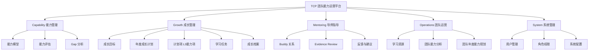

### 2.1 计划对象层级

成长管理模块内部的对象层级为：

```text
年度成长计划（个人/年度）
  └── 计划项（三级能力项 L3）
        └── 学习任务
              ├── Learning Progress Log（学习执行日志）
              └── Evidence
                    └── Evidence Review
```

- **年度成长计划（Annual Growth Plan）**：个人按年度维护的计划容器，默认周期为 12 个月，记录整体进度与统计；不简称为 Growth Plan，也不与团队年度能力规划混用。
- **计划项（Plan Item）**：从 Gap 分析中纳入计划的三级能力项，是计划与跟踪的最小单元。
- **学习任务（Learning Task）**：由计划项派生，用于记录执行过程，与计划项保持关联但独立维护执行状态。
- **学习执行日志（Learning Progress Log）**：Learning Task 下的执行记录，字段为 `task_id`、`record_date`、`actual_hours`、`note`、`recorder`，仅用于学习时长聚合，不拆分任务或改变 Plan Item → Learning Task 的 1:1 关系。
- **Evidence**：学习任务的可验证输出。
- **Evidence Review**：Buddy 对 Evidence 的复核与反馈记录。

### 2.2 模块说明

| 模块 | 职责 | 主要使用角色 |
|---|---|---|
| Capability | 维护能力标准、支撑能力评估、生成 Gap 分析 | Leader / Member / Buddy |
| Growth | 管理成长目标、年度成长计划、计划项、学习任务执行、学习执行日志、成长档案 | Member / Buddy |
| Mentoring | Buddy 对成员自评与 Evidence 进行辅导、复核和反馈 | Buddy / Member |
| Operations | 维护学习资源、团队能力分析、团队年度能力规划 | Leader |
| System | 用户、角色、权限、系统参数 | Admin |

---

## 3. 用户导航结构

平台采用顶部主导航 + 左侧子导航的布局。

### 3.1 顶部主导航

```
[能力管理] [成长管理] [导师指导] [团队运营] [系统管理] [个人中心]
```

### 3.2 各角色默认首页

| 角色 | 默认首页 | 说明 |
|---|---|---|
| Member | 我的成长看板 | 展示年度进度、待办任务、待提交 Evidence |
| Buddy | 辅导成员看板 | 展示负责成员列表、待 Review 的 Evidence、待复核的自评 |
| Leader | 团队运营看板 | 展示团队能力分析、团队年度能力规划 |
| Admin | 系统管理首页 | 展示用户、角色、系统配置入口 |

### 3.3 左侧子导航示例

**能力管理模块下：**

```
- 能力模型
- 能力自评
- Gap 分析
- 评估历史
```

**成长管理模块下：**

```
- 成长目标
- 年度成长计划
- 学习任务
- 成长档案
```

**导师指导模块下：**

```
- 我的辅导成员
- 自评复核
- Evidence Review
- 反馈记录
```

**团队运营模块下：**

```
- 学习资源
- 团队能力分析
- 团队年度能力规划
```

**系统管理模块下：**

```
- 用户管理
- 角色权限
- 系统配置
```

---

## 4. 页面清单

| 页面名称 | 路由路径 | 主要角色 | 所属模块 | 页面目的 | 关联业务对象 |
|---|---|---|---|---|---|
| 我的成长看板 | /dashboard/member | Member | Growth | 查看年度进度、待办、完成情况 | Annual Growth Plan / Plan Item / Learning Task / Learning Progress Log / Evidence |
| 能力模型 | /capability/model | 全员 | Capability | 查看一级 / 二级 / 三级能力项及等级描述 | Capability Model |
| 能力自评 | /capability/assessment | Member | Capability | 填写当前掌握度、目标掌握度、自评依据 | Assessment |
| Gap 分析 | /capability/gap | Member / Buddy | Capability | 查看 Gap 值、分级、优先级，选择纳入计划项 | Gap |
| 评估历史 | /capability/assessment/history | Member / Buddy | Capability | 查看历次评估快照与成长曲线 | Assessment |
| 成长目标 | /growth/goals | Member | Growth | 确认年度补齐目标 | Growth Goal / Gap |
| 年度成长计划 | /growth/annual-plan | Member | Growth | 查看和编辑年度成长计划及其计划项 | Annual Growth Plan / Plan Item |
| 学习任务 | /growth/tasks | Member | Growth | 跟踪学习任务执行状态、填写学习执行日志、提交 Evidence | Learning Task / Learning Progress Log / Evidence / Plan Item |
| 月度复盘 | /growth/review/monthly | Member / Buddy / Leader | Growth | 查看月度计划完成情况 | Plan Item / Learning Task |
| 成长档案 | /growth/profile | Member | Growth | 查看个人完整成长记录 | Capability Profile |
| 辅导成员看板 | /mentoring/dashboard | Buddy | Mentoring | 查看负责成员进度与待办 | Member / Learning Task / Evidence |
| 自评复核 | /mentoring/assessment-review | Buddy | Mentoring | 复核 Member 自评结果并给出反馈 | Assessment / Assessment Review |
| Evidence Review | /mentoring/evidence-review | Buddy | Mentoring | 复核 Evidence 并填写反馈 | Evidence / Evidence Review |
| 反馈记录 | /mentoring/feedback | Buddy / Member | Mentoring | 查看历史复核反馈 | Assessment Review / Evidence Review |
| 学习资源 | /operations/resources | Leader | Operations | 维护学习材料索引 | Learning Resource |
| 团队能力分析 | /operations/analytics | Leader | Operations | 查看团队 Gap 分布、完成率等指标 | Assessment / Plan Item / Evidence |
| 团队年度能力规划 | /operations/team-annual-plan | Leader | Operations | 发布团队年度能力运营重点 | Team Annual Capability Plan |
| 用户管理 | /system/users | Admin | System | 创建、编辑、启用 / 禁用用户 | User |
| 角色权限 | /system/roles | Admin | System | 分配角色与数据权限 | Role / Permission |
| 系统配置 | /system/settings | Admin | System | 维护系统参数 | System Config |
| 个人中心 | /profile | 全员 | System | 查看和修改个人信息 | User |

---

## 5. 用户流程（User Flow）

### 5.1 Member 主线流程

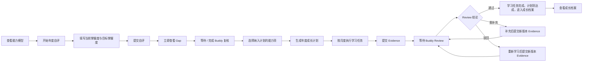

说明：

- Member 提交自评后可立即查看 Gap 并设置优先级。
- 正式将 Gap 纳入年度成长计划（包括生成年度成长计划及其计划项）的统一门禁：当前 Assessment 最新一次提交对应的 Assessment Review 已闭环，Review 结论为「认可」，且不存在待复核事项。

### 5.2 Buddy 辅导流程

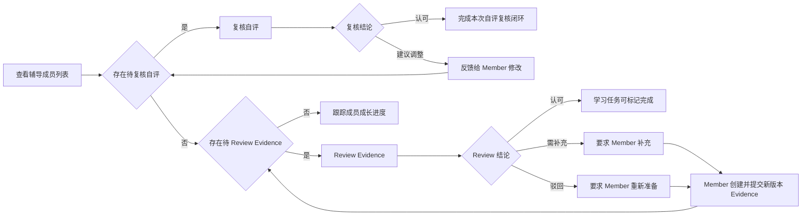

### 5.3 Leader 运营流程

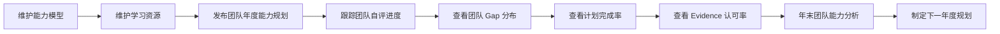

### 5.4 Admin 管理流程

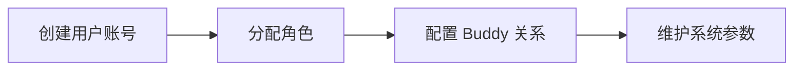

---

## 6. 核心业务状态机

### 6.1 Assessment 状态机

Assessment 指一次完整的能力评估记录，按年度或晋升 / 转岗触发。每次 Assessment 可包含多条 Assessment Review 记录：Member 每次提交自评时生成一条待复核记录，Buddy 给出复核结论后该记录闭环；Member 调整后重新提交时创建新的 Assessment Review，历史记录不覆盖。

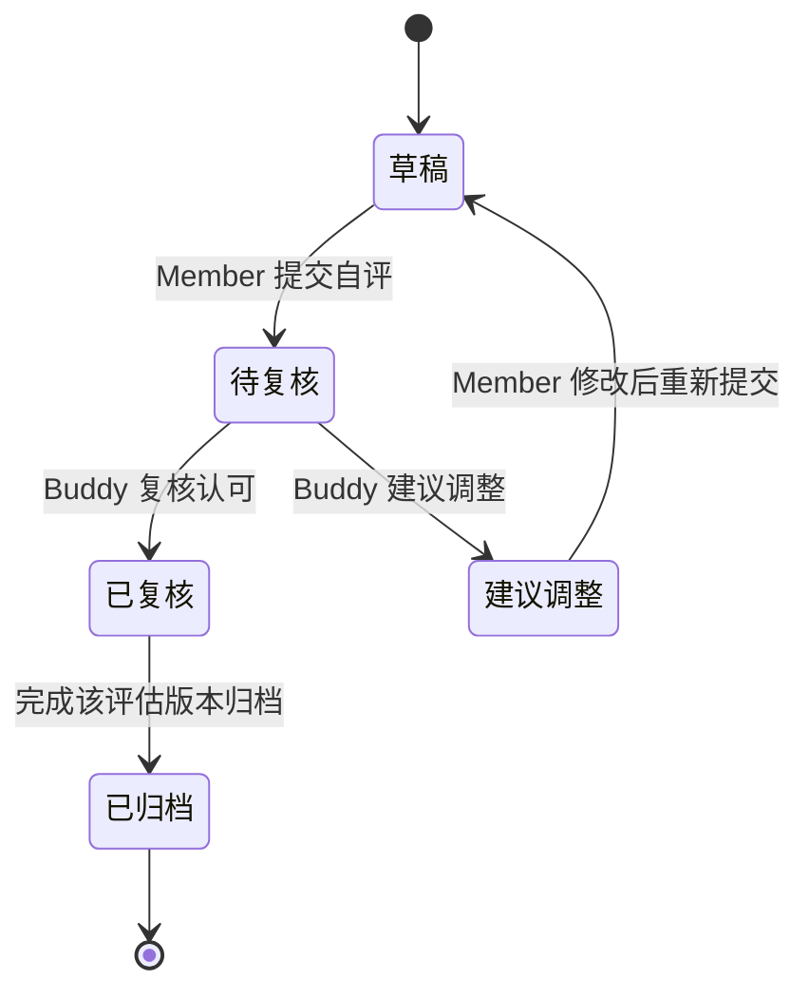

年中更新规则：

- Member 在执行过程中更新当前掌握度时，不修改已归档的 Assessment。
- 系统基于当前年度 Assessment 生成一个新版本 Assessment。
- 新版本 Assessment 重新进入「草稿 → 待复核 → 已复核 → 已归档」流程。
- 旧版本 Assessment 保持已归档状态，纳入评估历史。

状态说明：

| 状态 | 说明 |
|---|---|
| 草稿 | Member 正在填写自评，未提交 |
| 待复核 | Member 已提交，等待 Buddy 复核 |
| 已复核 | Buddy 复核认可，该版本评估闭环归档；Member 可查看 Gap 与设置优先级；正式将 Gap 纳入年度成长计划（包括生成年度成长计划及其计划项）的统一门禁：当前 Assessment 最新一次提交对应的 Assessment Review 已闭环，Review 结论为「认可」，且不存在待复核事项。 |
| 建议调整 | Buddy 认为自评不合理，Member 可选择修改后重新提交；Member 可查看 Gap 与设置优先级；此状态下 Gap 不可正式纳入年度成长计划 |
| 已归档 | 该次评估已闭环，进入历史记录 |

Gap 生成时点：

- Member 提交自评后，系统立即基于当前掌握度与目标掌握度生成 Gap。
- Member 无需等待 Buddy 复核即可查看 Gap、设置优先级。
- 正式将 Gap 纳入年度成长计划（包括生成年度成长计划及其计划项）的统一门禁：当前 Assessment 最新一次提交对应的 Assessment Review 已闭环，Review 结论为「认可」，且不存在待复核事项。
- Buddy 的复核结论（认可 / 建议调整）用于反馈与历史记录。

Assessment Review 是 Buddy 对一次 Assessment 的复核记录。

| 属性 | 说明 |
|---|---|
| 关联对象 | 一个 Assessment 对应多条 Assessment Review（每次提交生成一条） |
| 复核结论 | 认可 / 建议调整 |
| 复核反馈 | Buddy 的具体意见与建议 |
| 复核人 | 负责该 Member 的 Buddy |
| 复核时间 | Review 完成时间 |
| 状态 | 待复核 / 已闭环 |
| 版本规则 | Member 调整后重新提交时创建新的 Assessment Review；历史 Review 记录保留并闭环 |

### 6.2 计划项状态机

计划项（Plan Item）是年度成长计划中的最小跟踪单元，对应一个纳入计划的三级能力项。

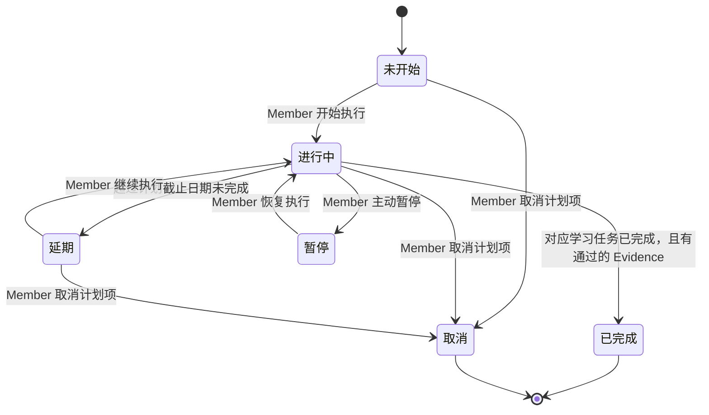

状态说明：

| 状态 | 说明 |
|---|---|
| 未开始 | 计划项已生成，尚未开始执行 |
| 进行中 | 已开始执行，尚未达到完成判定条件 |
| 已完成 | 学习任务已完成，且 Evidence 获 Buddy 认可 |
| 延期 | 超过计划截止日期未完成 |
| 暂停 | 临时中止，后续可恢复 |
| 取消 | 不再执行，需记录原因 |

### 6.3 年度成长计划状态机

年度成长计划（Annual Growth Plan）是个人年度的计划容器，状态反映整体计划周期。

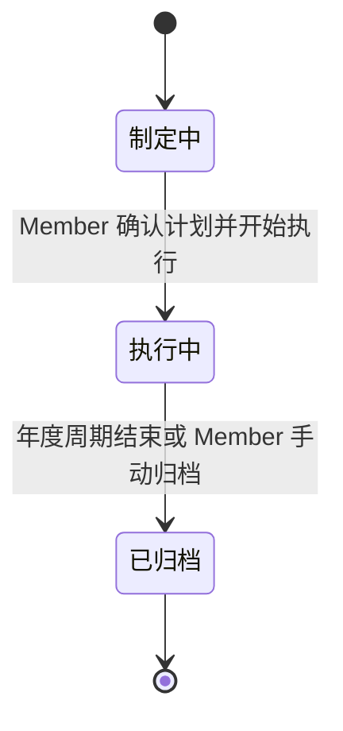

### 6.4 Learning Task 状态机

Learning Task 由计划项派生，用于记录该 L3 计划项的执行与 Evidence 提交过程。它不是另一份计划项：一个计划项派生一个学习任务；计划项反映该 L3 的年度计划达成，学习任务反映执行与 Evidence Review 进度。

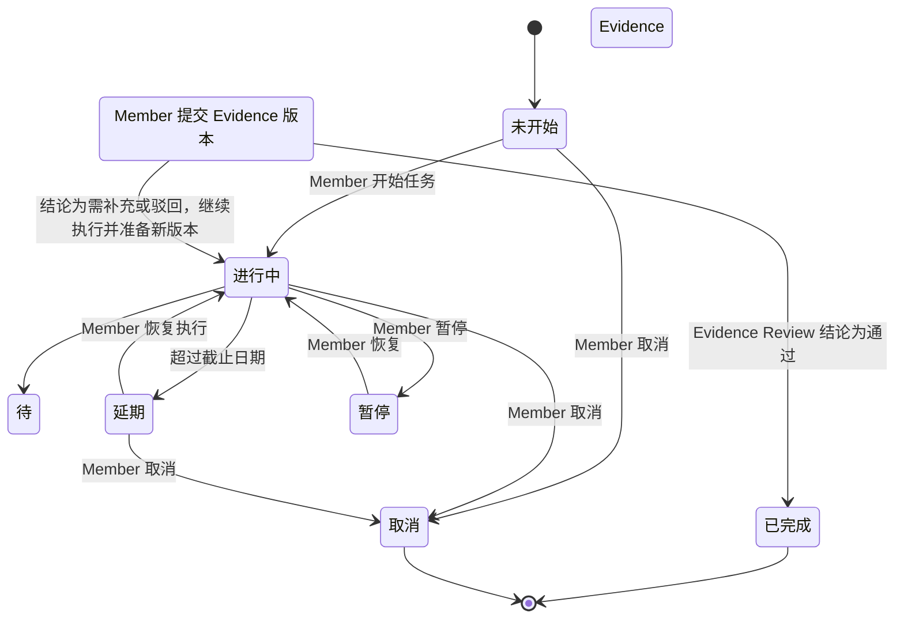

说明：

- 学习任务只有在某个 Evidence 版本获得 Buddy「通过」结论后才完成；计划项据此达到完成判定条件。
- 「需补充」或「驳回」只结束当前 Evidence 版本及其 Review。Member 继续执行时创建新的 Evidence 版本并触发新的 Review 记录，旧版本和旧 Review 不回流。

### 6.5 Evidence 状态机

Evidence 是学习任务的可验证输出，必须对应一个 L3 能力项。Member 可在提交前保存草稿；每次提交形成一个 Evidence 版本。补充或重新提交必须创建新版本 Evidence，而不是改写或重新流转旧版本。

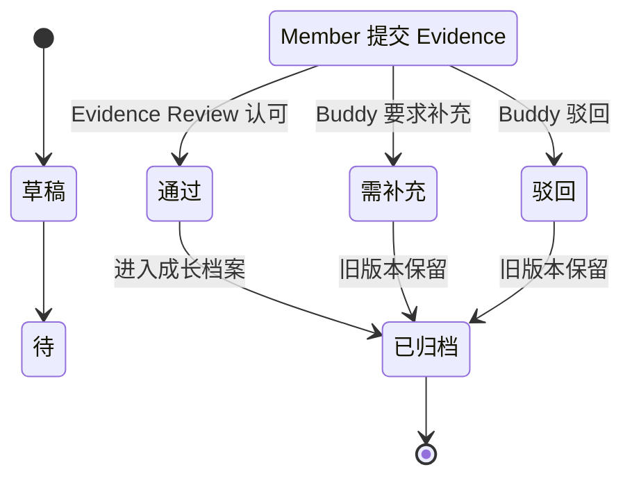

状态说明：

| 状态 | 说明 |
|---|---|
| 草稿 | Member 正在准备 Evidence，尚未提交 |
| 待 Review | Member 已提交，等待 Evidence Review |
| 通过 | Buddy 认可该 Evidence 充分证明能力达成 |
| 需补充 | Buddy 认为 Evidence 不足，Member 需补充材料后提交新版本 |
| 驳回 | Buddy 认为 Evidence 明显不符合要求，Member 需重新准备后提交新版本 |
| 已归档 | 当前 Evidence 版本及其 Review 已结束；通过版本进入成长档案，需补充或驳回版本作为历史保留 |

版本规则：

- 「需补充」「驳回」及「已归档」的旧 Evidence 版本不得直接回到「待 Review」。
- Member 补充或重新提交时，从同一学习任务创建新的「草稿」版本；该新版本提交后进入「待 Review」，并创建新的 Evidence Review 记录。

### 6.6 Evidence Review 状态机

Evidence Review 是 Buddy 对一个已提交 Evidence 版本作出的历史反馈记录。每个已提交 Evidence 版本对应一条 Evidence Review；Review 给出反馈后即闭环，不因后续 Evidence 版本而重新进入待 Review。

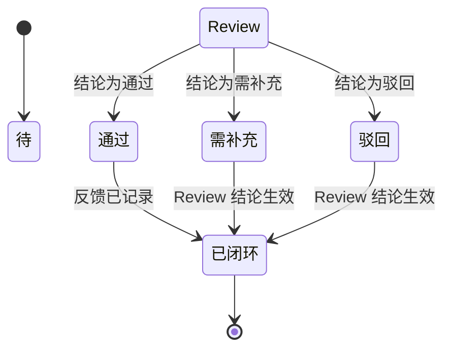

状态说明：

| 状态 | 说明 |
|---|---|
| 待 Review | Buddy 收到待复核 / 待 Review 项 |
| 通过 | Buddy 认可其有效或充分 |
| 需补充 | Buddy 要求补充材料或说明 |
| 驳回 | Buddy 认为明显不符合要求 |
| 已闭环 | Review 结论已记录，该条 Review 结束 |

说明：

- Buddy 的「通过 / 需补充 / 驳回」是指导、Evidence Review 与反馈结论，不承担行政决策职责。
- 当结论为「需补充」或「驳回」时，Member 提交新版本 Evidence 会触发一条新的 Review 记录；原 Review 保持闭环历史，不得再次流转。

---

## 7. 角色权限设计（RBAC）

### 7.1 角色定义

平台固定四类角色，权限可叠加。

| 角色 | 职责定位 |
|---|---|
| Member | 执行自评、制定计划、完成任务、提交 Evidence |
| Buddy | 辅导成员、复核自评、Review Evidence、跟踪进度 |
| Leader | 维护能力模型与学习资源、团队分析、团队年度能力规划 |
| Admin | 用户、角色、权限、系统配置管理 |

### 7.2 权限列表

| 权限编码 | 权限名称 | 说明 |
|---|---|---|
| capability.model.view | 查看能力模型 | 查看能力域、能力项、等级描述 |
| capability.model.manage | 维护能力模型 | 编辑能力域、能力项、等级描述、导入导出 |
| assessment.self | 完成自评 | Member 填写并提交自评 |
| assessment.view.own | 查看自己的评估 | Member 查看个人评估历史 |
| assessment.view.assigned | 查看负责成员的评估 | Buddy 查看辅导成员评估 |
| assessment.view.team | 查看团队评估 | Leader 查看团队整体评估 |
| assessment.review | 复核自评 | Buddy 复核自评结果 |
| gap.view.own | 查看自己的 Gap | Member 查看个人 Gap 分析 |
| gap.view.assigned | 查看负责成员的 Gap | Buddy 查看辅导成员 Gap |
| gap.view.team | 查看团队 Gap | Leader 查看团队 Gap 分布 |
| plan.manage.own | 管理自己的年度成长计划 | Member 制定和调整年度计划 |
| plan.view.assigned | 查看负责成员的计划 | Buddy 查看辅导成员计划 |
| plan.view.team | 查看团队计划 | Leader 查看团队计划完成情况 |
| task.manage.own | 管理自己的学习任务 | Member 执行任务、更新状态 |
| task.view.assigned | 查看负责成员的任务 | Buddy 查看辅导成员任务 |
| evidence.submit.own | 提交自己的 Evidence | Member 提交 Evidence |
| evidence.view.assigned | 查看负责成员的 Evidence | Evidence Review 使用 |
| evidence.review | Review Evidence | Buddy 给出 Review 结论 |
| evidence.view.team | 查看团队 Evidence | Leader 查看团队 Evidence |
| profile.view.own | 查看自己的成长档案 | Member 查看个人档案 |
| profile.view.assigned | 查看负责成员的档案 | Buddy 查看辅导成员档案 |
| profile.view.team | 查看团队成长档案 | Leader 查看团队档案 |
| resource.manage | 维护学习资源 | Leader 维护学习材料索引 |
| analytics.view.team | 查看团队分析 | Leader 查看团队能力分析 |
| teamannualplan.manage | 管理团队年度能力规划 | Leader 发布团队年度规划 |
| user.manage | 管理用户 | Admin 创建、编辑用户 |
| role.manage | 管理角色权限 | Admin 分配角色 |
| system.config | 系统配置 | Admin 维护系统参数 |

### 7.3 角色权限矩阵

| 权限 | Member | Buddy | Leader | Admin |
|---|---|---|---|---|
| 查看能力模型 | ✓ | ✓ | ✓ | ✓ |
| 维护能力模型 | - | - | ✓ | - |
| 完成自评 | ✓ | - | - | - |
| 查看自己的评估 | ✓ | ✓ | ✓ | ✓ |
| 查看负责成员的评估 | - | ✓ | - | ✓ |
| 查看团队评估 | - | - | ✓ | ✓ |
| 复核自评 | - | ✓ | - | - |
| 查看自己的 Gap | ✓ | ✓ | ✓ | ✓ |
| 查看负责成员的 Gap | - | ✓ | - | ✓ |
| 查看团队 Gap | - | - | ✓ | ✓ |
| 管理自己的年度成长计划 | ✓ | - | - | - |
| 查看负责成员的计划 | - | ✓ | - | ✓ |
| 查看团队计划 | - | - | ✓ | ✓ |
| 管理自己的学习任务 | ✓ | - | - | - |
| 查看负责成员的任务 | - | ✓ | - | ✓ |
| 提交自己的 Evidence | ✓ | - | - | - |
| 查看负责成员的 Evidence | - | ✓ | - | ✓ |
| Review Evidence | - | ✓ | - | - |
| 查看团队 Evidence | - | - | ✓ | ✓ |
| 查看自己的成长档案 | ✓ | ✓ | ✓ | ✓ |
| 查看负责成员的档案 | - | ✓ | - | ✓ |
| 查看团队成长档案 | - | - | ✓ | ✓ |
| 维护学习资源 | - | - | ✓ | - |
| 查看团队分析 | - | - | ✓ | ✓ |
| 管理团队年度能力规划 | - | - | ✓ | - |
| 管理用户 | - | - | - | ✓ |
| 管理角色权限 | - | - | - | ✓ |
| 系统配置 | - | - | - | ✓ |

### 7.4 数据可见性

数据可见性按用户当前拥有的有效角色叠加生效；一个 User 与 Role 为 N:M 关系，角色权限取并集，不相互排斥：

| 数据范围 | 说明 | 生效角色 |
|---|---|---|
| 本人数据 | 用户自己的评估、Gap、年度成长计划、计划项、学习任务、学习执行日志、Evidence、成长档案 | Member（自己） |
| Buddy 负责成员数据 | Buddy 所负责成员的相关数据 | Buddy（负责成员） |
| Leader 团队数据 | 团队内所有成员的相关数据 | Leader（整个团队） |
| 全量数据 | 平台全部数据 | Admin |

说明：

- 多角色用户按有效角色权限叠加。例如 Leader 同时是 Member 时，可查看本人数据与团队数据；Buddy 同时是 Member 时，也保留本人数据访问范围。
- Buddy 只能查看自己被明确分配负责的成员数据，不能查看其他成员数据。
- Leader 可查看整个团队数据，但当前产品规则未开放 Leader 直接修改 Member 自评、计划或 Evidence。
- Admin 默认拥有全量数据查看权限与系统管理权限；自评、复核、Review、计划维护等业务操作权限需通过 Member / Buddy / Leader 角色叠加获得。

---

## 8. 核心对象关系说明

平台核心对象及其关系如下：

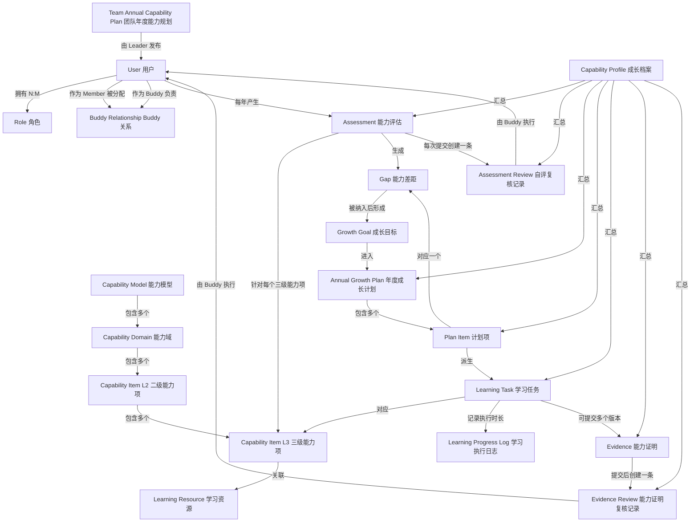

### 8.1 对象关系说明

| 关系 | 基数 | 说明 |
|---|---|---|
| User : Role | N:M | 一个用户可拥有多个角色，权限叠加 |
| User : Buddy Relationship | 1:N | MVP 中每个 Member 仅有 1 名主 Buddy；一个 Buddy 可负责多个 Member |
| Capability Model : Capability Domain | 1:N | 一个能力模型包含多个一级能力域 |
| Capability Domain : Capability Item L2 | 1:N | 一个能力域包含多个二级能力项 |
| Capability Item L2 : Capability Item L3 | 1:N | 一个二级能力项包含多个三级能力项 |
| Capability Item L3 : Learning Resource | N:M | 一个三级能力项可关联多个学习材料；一个材料可服务于多个能力项 |
| User : Assessment | 1:N | 一个用户每年可产生一次或多次评估 |
| Assessment : Capability Item L3 | N:M | 一次评估针对多个三级能力项打分 |
| Assessment : Assessment Review | 1:N | 一次 Assessment 可包含多条 Assessment Review；每次提交生成一条，历史记录保留 |
| Assessment : Gap | 1:N | 一次评估生成多个 Gap 项 |
| Gap : Growth Goal | 1:1 | 一个被纳入计划的 Gap 项形成一个成长目标 |
| Growth Goal : Annual Growth Plan | N:1 | 多个成长目标归属于一份年度成长计划 |
| Annual Growth Plan : Plan Item | 1:N | 一份年度成长计划包含多个计划项 |
| Plan Item : Learning Task | 1:1 | 一个计划项派生一个学习任务 |
| Learning Task : Learning Progress Log | 1:N | 一个学习任务可有多条学习执行日志；日志仅用于按日期聚合实际时长，不拆分任务 |
| Learning Task : Evidence | 1:N | 一个学习任务可产生多个 Evidence 版本 |
| Evidence : Evidence Review | 1:1 | 每个已提交 Evidence 版本创建一条 Evidence Review 记录；补充或重新提交创建新的 Evidence 版本与新的 Review 记录 |
| Team Annual Capability Plan : User | 1:N | 一份团队年度能力规划面向团队内多个用户 |
| Capability Profile : User | 1:1 每年 | 每个用户每年生成一份成长档案 |

---

## 9. 页面与业务对象映射

| 页面 | 主要业务对象 | 支持操作 |
|---|---|---|
| 我的成长看板 | Annual Growth Plan / Plan Item / Learning Task / Learning Progress Log / Evidence | 查看进度、待办提醒与学习时长 |
| 能力模型 | Capability Model / Capability Domain / Capability Item | 查看、按域筛选、展开能力项 |
| 能力自评 | Assessment / Capability Item L3 | 填写掌握度、目标、依据、提交 |
| Gap 分析 | Gap / Capability Item L3 | 查看 Gap、设置优先级、选择纳入计划 |
| 评估历史 | Assessment | 查看快照、成长曲线 |
| 成长目标 | Growth Goal / Gap | 确认年度补齐目标 |
| 年度成长计划 | Annual Growth Plan / Plan Item | 查看、编辑年度成长计划及其计划项 |
| 学习任务 | Learning Task / Learning Progress Log / Evidence / Plan Item | 更新状态、填写学习执行日志、提交 Evidence |
| 月度复盘 | Plan Item / Learning Task | 查看月度统计、填写复盘 |
| 成长档案 | Capability Profile / Assessment / Annual Growth Plan / Plan Item / Learning Task / Evidence | 查看年度成长记录 |
| 辅导成员看板 | Member / Learning Task / Evidence | 查看负责成员进度与待办 |
| 自评复核 | Assessment / Assessment Review | 复核自评、给出反馈 |
| Evidence Review | Evidence / Evidence Review | 复核 Evidence、填写反馈 |
| 反馈记录 | Assessment Review / Evidence Review | 查看历史复核反馈 |
| 学习资源 | Learning Resource / Capability Item L3 | 新增、编辑、关联能力项 |
| 团队能力分析 | Assessment / Gap / Plan Item / Evidence | 查看团队指标、Gap 分布 |
| 团队年度能力规划 | Team Annual Capability Plan / Capability Domain | 发布年度重点、查看执行情况 |
| 用户管理 | User / Role | 创建、编辑、启用 / 禁用用户 |
| 角色权限 | Role / Permission | 分配角色、配置权限 |
| 系统配置 | System Config | 维护系统参数 |
| 个人中心 | User | 查看和修改个人信息 |

---

## 10. 设计约束与说明

1. **Product 为唯一业务来源**：所有页面、流程、状态机均来源于 `docs/01_Product.md`，Design 不做业务规则修改。
2. **MVP 边界**：页面与流程优先覆盖单团队、技术架构与开发专业线、四类角色的核心闭环。
3. **无代码 / 无 API / 无数据模型**：本阶段不描述具体实现、接口或数据库表结构。
4. **计划对象层级**：年度成长计划、计划项、学习任务、Evidence 为四层独立对象，状态各自维护，避免将计划项与学习任务完全等同。
5. **Buddy 定位**：Buddy 负责指导、自评复核、Evidence Review、反馈与跟踪，不承担行政决策职责；Review 结论用于反馈与跟踪，不影响成员继续学习。
6. **状态机闭环**：Review 记录按次闭环；Evidence 被补充或驳回后产生新版本，原版本记录保留。
7. **MVP 能力域收敛**：MVP 仅启用 P01、P02、P03、C01、C02、C03 六个能力域；架构与工程、咨询与方案、DevOps 与稳定性三个域仅保留扩展占位，不导入有效 L3，不参与自评、Gap、计划、学习任务、Evidence、团队分析，也不在页面中作为可操作能力域展示。
