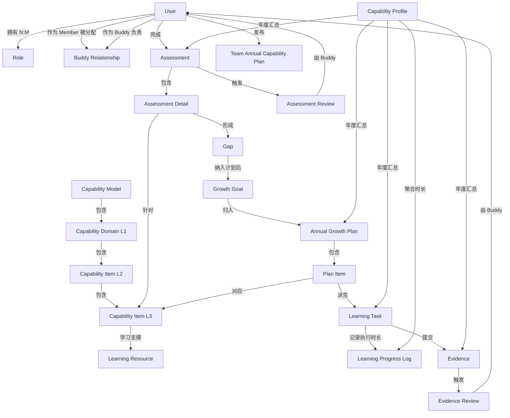

# 03 Data

## 1. 设计边界

本文档为 TCP MVP 的**逻辑数据设计**，用于明确核心业务对象、字段、状态、版本、年度、关联关系、唯一性约束和维护角色。

约束：

- 不定义物理表、SQL、索引、存储过程。
- 不定义接口、代码、技术实现细节。
- 所有对象与规则均来源于 `docs/01_Product.md` 与 `docs/02_Design.md`。

---

## 2. 核心对象清单

| 对象 | 业务定义 | 维护角色 |
|---|---|---|
| User | 平台使用者 | Admin |
| Role | 用户角色（Member / Buddy / Leader / Admin） | Admin |
| Buddy Relationship | Buddy 与 Member 的辅导关系 | Admin |
| Capability Model | 能力模型容器 | Leader |
| Capability Domain L1 | 一级能力域 | Leader |
| Capability Item L2 | 二级能力项 | Leader |
| Capability Item L3 | 三级能力项，计划与跟踪最小单元 | Leader |
| Learning Resource | 学习材料索引 | Leader |
| Assessment | Member 对 L3 的能力评估 | Member |
| Assessment Detail | Assessment 中针对单个 L3 的评分记录 | Member |
| Assessment Review | Buddy 对 Assessment 的复核记录 | Buddy |
| Gap | Assessment 中当前与目标掌握度的差距 | 系统生成，Member 确认 |
| Growth Goal | 被纳入计划的 Gap 形成的年度补齐目标 | Member |
| Annual Growth Plan | Member 的个人年度成长计划容器 | Member |
| Plan Item | 年度成长计划内对应一个 L3 的计划单元 | Member |
| Learning Task | Plan Item 的执行单元 | Member |
| Learning Progress Log | Learning Task 下的学习执行日志，仅用于学习时长聚合 | Member |
| Evidence | Learning Task 的可验证输出版本 | Member |
| Evidence Review | Buddy 对 Evidence 版本的复核记录 | Buddy |
| Team Annual Capability Plan | Leader 发布的团队年度能力规划 | Leader |
| Capability Profile | 按 Member、年度汇总的成长档案 | 系统自动汇总 |
| System Config | 系统级参数与配置项 | Admin |

---

## 3. 对象详细定义

### Issue #50 Assessment 续评基准与修改版本

Assessment 保留一个单调修改版本，用于识别并发写入是否基于当前记录；客户端读取当前版本，修改和提交时带回预期版本，版本不一致时本次修改整体失败，不覆盖其他 Member 或 Assessment。

Assessment Detail 可记录：

| 字段 | 说明 |
|---|---|
| inherited_from_assessment_id | 当前 L3 继承来源 Assessment；无可信来源时为空 |
| inherited_current_level | 创建时复制的历史当前等级基准 |
| inherited_evidence_note | 创建时复制的历史依据基准 |

来源选择跨年度、跨评估类型，仅接受同一 Member 最近一次 Review 已闭环且结论为「认可」的「已复核/已归档」Assessment。新记录只复制 L3 交集中的当前等级和有效依据；不复制目标、调整、Gap、优先级或计划候选。历史 Assessment 不被修改。

### Issue #50 保存与候选一致性

草稿允许部分完成，未提交的明细保持原值；生成所选学习任务时（#178）只重新读取并校验被选 L3 的等级、依据、适用性、完整性及计划季度/月份，未选中的 L3 不参与校验。1–2 级依据可为空，3–5 级提交需有效依据；相对认可基准任意提升时必须更新依据。

计划字段的中间状态可保存：正 Gap 行允许「已纳入计划（include_in_plan=TRUE）但未填优先级/计划月份」等部分填写并原样保留（v0015 起）；互斥冲突（暂缓+纳入）与季度-月份矛盾在保存时即拒绝。计划时间无任何默认值：显式生成学习任务（#178）时对每个选中 L3 逐项校验计划季度与计划月份，任一选中项缺失则整批拒绝并逐项提示；评级保存/提交不校验计划时间，也不生成或复用任何学习任务（提交门禁只校验评估结果）。

显式生成（#178）为并发安全写操作：请求携带 `expected_revision`，服务端锁定 Assessment 行后校验版本，过期返回 409 且零写入；同时对整个选中批次校验计划依据快照（v0009），任一选中 L3 缺快照则返回 422 `selection_validation_failed`（逐 L3 给出 `planning_snapshot_missing`）并整批零写入，绝不误报「已存在」。请求可携带 `Idempotency-Key`（写入 `assessment_idempotency_key`）：同 key 同请求重放返回首次响应（`idempotent_replayed=true`）且不重复写入、不再次推进 revision，同 key 不同请求返回 409；并发同 key 请求由 Assessment 行锁串行化，恰好创建一个计划项与学习任务。本批有新增计划项时在同一事务内恰好推进一次 Assessment `revision`（返回最新值供前端继续携带）；纯已存在批保持 `revision` 不变。成功响应逐 L3 区分 `created` / `existing` 并返回最新 `revision` 与中文摘要。

计划候选由系统校验：未评估、不适用、无最终目标、Gap 不为正、兼容错误或依据不合格时主动提交候选属于非法请求；合法修改使已有 Gap 归零或不再适用时，系统在同一事务自动取消候选并同步 Gap。

### 3.1 User

| 项目 | 说明 |
|---|---|
| 业务定义 | 平台使用者，可拥有一个或多个 Role |
| 业务字段 | 用户编码、姓名、邮箱、当前职级、目标职级、所属团队、账号状态、创建时间 |
| 状态 | 启用 / 禁用 |
| 版本 / 年度 | 不随年度变化；职级信息可调整，保留历史由 Capability Profile 承载 |
| 关联关系 | N:M Role；1:N Assessment；1:1 主 Buddy Relationship（作为 Member）；1:N Buddy Relationship（作为 Buddy） |
| 唯一性约束 | 用户编码唯一、邮箱唯一 |
| 维护角色 | Admin 创建与启用 / 禁用；Member 可维护个人信息 |

### 3.2 Role

| 项目 | 说明 |
|---|---|
| 业务定义 | 平台固定角色：Member、Buddy、Leader、Admin |
| 业务字段 | 角色编码、角色名称、权限集合 |
| 状态 | 启用 / 禁用 |
| 版本 / 年度 | 全局固定，不随年度变化 |
| 关联关系 | N:M User（一个用户可拥有多个角色，权限叠加） |
| 唯一性约束 | 角色编码唯一 |
| 维护角色 | Admin 分配用户角色；MVP 阶段不新增角色 |

### 3.3 Buddy Relationship

| 项目 | 说明 |
|---|---|
| 业务定义 | MVP 中每个 Member 仅有 1 名主 Buddy；一个 Buddy 可负责多个 Member |
| 业务字段 | 关系编码、Member 用户编码、Buddy 用户编码、生效时间、失效时间 |
| 状态 | 生效 / 失效 |
| 版本 / 年度 | 可按年度调整，历史关系保留供追溯 |
| 关联关系 | N:1 User（Member 端）；N:1 User（Buddy 端） |
| 唯一性约束 | 同一 Member 在同一时间仅可有 1 条生效的主 Buddy 关系 |
| 维护角色 | Admin 配置 |

### 3.4 Capability Model

| 项目 | 说明 |
|---|---|
| 业务定义 | 团队能力标准容器，MVP 阶段对应技术架构与开发专业线 |
| 业务字段 | 模型编码、模型名称、专业线、版本号、生效状态 |
| 状态 | 生效 / 历史 |
| 版本 / 年度 | 可版本化，MVP 阶段以单一模型为主 |
| 关联关系 | 1:N Capability Domain L1 |
| 唯一性约束 | 模型编码唯一 |
| 维护角色 | Leader 维护，Admin 可辅助 |

### 3.5 Capability Domain L1

| 项目 | 说明 |
|---|---|
| 业务定义 | 一级能力域，分为专业能力域与通用素质能力域；MVP 仅启用 P01/P02/P03/C01/C02/C03，其余三个专业能力域仅保留扩展位 |
| 业务字段 | 域编码、域名称、域类型（专业 / 通用）、MVP 启用标识、权重说明、排序 |
| 状态 | 启用 / 禁用 / 扩展占位 |
| 版本 / 年度 | 随 Capability Model 版本管理 |
| 关联关系 | N:1 Capability Model；1:N Capability Item L2 |
| 唯一性约束 | 同一模型内域编码唯一 |
| 维护角色 | Leader |
| 权重说明 | 专业能力 70%、通用素质 30% 仅作为规划口径保留；MVP 不据此生成个人综合总分 |

### 3.6 Capability Item L2

| 项目 | 说明 |
|---|---|
| 业务定义 | 二级能力项，属于某个一级能力域 |
| 业务字段 | 二级编码、二级能力项名称、所属 L1 编码、排序 |
| 状态 | 启用 / 禁用 |
| 版本 / 年度 | 随 Capability Model 版本管理 |
| 关联关系 | N:1 Capability Domain L1；1:N Capability Item L3 |
| 唯一性约束 | 同一模型内二级编码唯一 |
| 维护角色 | Leader |

### 3.7 Capability Item L3

| 项目 | 说明 |
|---|---|
| 业务定义 | 三级能力项，评估、计划与跟踪的最小单元 |
| 业务字段 | 三级编码、三级能力项名称、所属 L2 编码、建议起始职级、P4～P8 标准目标覆盖、学习材料编码、预期输出 / 验收方式、预计耗时、排序 |
| 状态 | 启用 / 禁用 |
| 版本 / 年度 | 随 Capability Model 版本管理 |
| 关联关系 | N:1 Capability Item L2；N:M Learning Resource；N:M Assessment（按次评分）；1:N Plan Item（同一 Annual Growth Plan 内同一 L3 唯一） |
| 唯一性约束 | 同一模型内三级编码唯一 |
| 维护角色 | Leader |

标准目标覆盖采用独立关联对象：同一 L3 + 职级最多一条。无记录表示使用默认映射；记录值为 1～5 表示指定覆盖；记录值为空表示明确「不适用」。低于建议起始职级不得存在覆盖记录，数据库约束之外仍由服务端按解析后的适用范围校验。

### 3.8 Learning Resource

| 项目 | 说明 |
|---|---|
| 业务定义 | 支撑 L3 学习或实践的材料索引，不是 Evidence |
| 业务字段 | 材料编码、材料名称、材料类型、材料来源 / 链接、用途说明、材料状态、关联 L3 编码 |
| 状态 | 有效 / 失效 / 待补充 |
| 版本 / 年度 | 不随年度变化，可独立维护 |
| 关联关系 | N:M Capability Item L3 |
| 唯一性约束 | 材料编码唯一 |
| 维护角色 | Leader |

### 3.9 Assessment

| 项目 | 说明 |
|---|---|
| 业务定义 | Member 对一组 L3 能力项的自评记录，按年度或晋升 / 转岗触发 |
| 业务字段 | 评估编码、Member 用户编码、年度、评估类型（年度 / 年中更新 / 晋升复核）、状态、单调 revision、创建时间、提交时间、归档时间 |
| 状态 | 草稿 / 待复核 / 已复核 / 建议调整 / 已归档（待复核 / 已复核 / 建议调整为历史提交流程状态；#178 新流程仅使用草稿与已归档） |
| 版本 / 年度 | 每个年度可存在多个版本；年中更新或晋升复核创建新版本，旧版本保持已归档 |
| 关联关系 | N:1 User；1:N Assessment Detail；1:N Assessment Review（历史提交流程每次提交生成一条；#178 新流程不再创建）；1:N Gap |
| 唯一性约束 | 同一 Member、同一年度、同一版本号唯一 |
| 维护角色 | Member 创建与填写；Buddy 复核（历史流程） |

### 3.10 Assessment Detail

| 项目 | 说明 |
|---|---|
| 业务定义 | Assessment 中针对单个 L3 能力项的评分记录 |
| 业务字段 | 明细编码、评估编码、L3 编码、当前掌握度、显式清空标记、标准目标是否适用、标准目标快照、是否个人调整、调整目标、调整原因、最终有效目标（兼容字段 `target_level`）、快照来源、继承基准等级、继承基准依据、兼容提示、Gap 值、自评依据、是否纳入计划 |
| 状态 | 无独立状态，随 Assessment 状态变化 |
| 版本 / 年度 | 随 Assessment 版本化 |
| 关联关系 | N:1 Assessment；N:1 Capability Item L3；1:1 Gap（当 Gap > 0） |
| 唯一性约束 | 同一 Assessment 内同一 L3 编码唯一 |
| 维护角色 | 系统生成标准与最终目标；Member 仅维护当前掌握度、自评依据、计划候选和合法个人调整 |

约束：不适用项的标准目标、最终有效目标和 Gap 为空，不能个人调整或纳入计划；适用项个人调整必须同时包含 1～5 的调整值与非空原因。标准目标、最终有效目标和 Gap 均由服务端计算，Member 请求不得直接覆盖。

显式清空标记用于区分“本次稀疏更新明确清空当前等级”和“从未填写”。L2 批量填写只作用于后者，不会把显式清空项或历史沿用项再次填回；迁移以 `FALSE` 兼容已有数据，并保持幂等。

### 3.11 Assessment Review

| 项目 | 说明 |
|---|---|
| 业务定义 | Buddy 对一次 Assessment 提交的复核记录，属于辅导性反馈，不是行政审批；同一 Assessment 可有多条历史 Review 记录（历史提交流程产物；#178 起新流程不再创建，仅只读兼容） |
| 业务字段 | Review 编码、评估编码、提交次序号、Buddy 用户编码、复核结论、复核反馈、复核时间 |
| 状态 | 待复核 / 已闭环 |
| 版本 / 年度 | 历史提交流程：每次 Member 提交 Assessment 时创建一条待复核记录；Buddy 反馈后闭环；Member 调整后重新提交创建新记录，历史记录保留 |
| 关联关系 | N:1 Assessment；N:1 User（Buddy） |
| 唯一性约束 | 同一 Assessment 版本内同一提交次序号唯一 |
| 维护角色 | Buddy |
| Review 结论 | 认可 / 建议调整 |

### 3.12 Gap

| 项目 | 说明 |
|---|---|
| 业务定义 | Assessment Detail 中服务端确认的最终有效目标与当前掌握度的差距；Member 生成所选学习任务时按被选 L3 生成（#178），未选择项不生成；不适用项不生成 Gap |
| 业务字段 | Gap 编码、评估编码、L3 编码、当前掌握度、目标掌握度、Gap 值、优先级、是否纳入计划 |
| 状态 | 无独立状态；以是否纳入计划作为计划判定依据 |
| 版本 / 年度 | 随 Assessment 版本化；新 Assessment 版本可能产生新的 Gap |
| 关联关系 | N:1 Assessment；N:1 Capability Item L3；1:1 Growth Goal（纳入计划时） |
| 唯一性约束 | 同一 Assessment 版本内同一 L3 编码唯一 |
| 维护角色 | 系统计算；Member 设置优先级与纳入计划标记；Buddy 可提供指导 |

### 3.13 Growth Goal

| 项目 | 说明 |
|---|---|
| 业务定义 | 被纳入计划的 Gap 形成的年度补齐目标 |
| 业务字段 | 目标编码、Gap 编码、L3 编码、年度、目标掌握度、优先级 |
| 状态 | 无独立状态 |
| 版本 / 年度 | 按年度管理 |
| 关联关系 | 1:1 Gap；N:1 Annual Growth Plan；1:1 Plan Item |
| 唯一性约束 | 同一 Annual Growth Plan 内同一 L3 编码唯一 |
| 维护角色 | Member |

### 3.14 Annual Growth Plan

| 项目 | 说明 |
|---|---|
| 业务定义 | Member 的个人年度成长计划容器，默认周期 12 个月 |
| 业务字段 | 计划编码、Member 用户编码、年度、计划周期、计划状态、计划开始日期、计划截止日期、创建时间 |
| 状态 | 制定中 / 执行中 / 已归档 |
| 版本 / 年度 | 每年一份；跨年时不自动延续计划项 |
| 关联关系 | N:1 User；1:N Growth Goal；1:N Plan Item；N:1 首次来源 Assessment；每个 Plan Item 另行记录自己的来源 Assessment Detail |
| 唯一性约束 | 同一 Member、同一年度唯一 |
| 维护角色 | Member |
| 生成约束 | Member 按所选 L3 生成学习任务时原子生成（#178，选中 L3 须显式填写计划季度与计划月份，且该 L3 存在计划依据快照，无默认值；任一选中项缺失则整批拒绝）；同一 Member 同一年度复用一份正式/可用计划，后续生成只新增尚未存在的 L3 计划项和任务，不覆盖已有执行记录。生成请求以 `expected_revision` 做乐观并发控制（过期 409、零写入），本批有新增时恰好推进一次 Assessment `revision`，纯已存在批保持不变；可携带 `Idempotency-Key` 保证同请求重放幂等（同 key 同请求返回首次响应且不推进 revision，同 key 不同请求 409）。 |

### 3.15 Plan Item

| 项目 | 说明 |
|---|---|
| 业务定义 | Annual Growth Plan 内对应一个 L3 的计划单元，是计划与跟踪的最小单元 |
| 业务字段 | 计划项编码、年度成长计划编码、Growth Goal 编码、L3 编码、当前掌握度、目标掌握度、优先级、学习材料、学习任务 / 实操内容、预期输出 / 验收方式、预计耗时、计划开始日期、计划截止日期、目标月份、状态 |
| 状态 | 未开始 / 进行中 / 已完成 / 延期 / 暂停 / 取消 |
| 并发控制 | 单调递增 `revision`；写请求携带 `expected_revision`，过期返回 409 `plan_revision_conflict` |
| 日期边界 | 计划开始日期须落在来源季度内，计划截止日期须落在来源计划月内（无来源月时同样限来源季度），且开始不晚于截止 |
| 版本 / 年度 | 按 Annual Growth Plan 年度管理 |
| 关联关系 | N:1 Annual Growth Plan；1:1 Growth Goal；N:1 Capability Item L3；1:1 Learning Task；N:1 来源 Assessment；1:1 来源 Assessment Detail |
| 唯一性约束 | 同一 Annual Growth Plan 内同一 L3 编码唯一 |
| 维护角色 | Member |

### 3.16 Learning Task

| 项目 | 说明 |
|---|---|
| 业务定义 | Plan Item 的执行单元，一个 Plan Item 对应一个 Learning Task，MVP 不拆分子任务 |
| 业务字段 | 任务编码、计划项编码、L3 编码、执行状态、实际开始日期、实际完成日期、实际耗时、完成质量、复盘结论、下步动作 |
| 状态 | 未开始 / 进行中 / 暂停 / 延期 / 已完成 / 取消（已完成、取消为终态） |
| 并发控制 | 单调递增 `revision`；写请求携带 `expected_revision`，过期返回 409 `task_revision_conflict` |
| 字段可写性 | 完成质量（`completion_quality`）、复盘结论（`review_conclusion`）、下步动作（`next_action`）由 Member 编辑；实际耗时（`actual_hours`）由有效日志机器聚合，不可直接编辑 |
| 版本 / 年度 | 按 Plan Item 年度管理 |
| 关联关系 | 1:1 Plan Item；N:1 Capability Item L3；1:N Evidence |
| 唯一性约束 | 同一 Plan Item 唯一 |
| 维护角色 | Member |

### 3.17 Evidence

| 项目 | 说明 |
|---|---|
| 业务定义 | Learning Task 的可验证输出版本 |
| 业务字段 | Evidence 编码、任务编码、L3 编码、版本号、提交内容说明、证据链接 / 文件、提交时间、状态 |
| 状态 | 草稿 / 待 Review / 通过 / 需补充（枚举保留「驳回」「已归档」，当前无代码路径产生） |
| 版本 / 年度 | 同一 Learning Task 下多个版本顺序递增；仅「需补充」版本可被新版本取代（`supersedes_evidence_id`），「通过」为终态 |
| 并发控制 | 单调递增 `revision`；写请求携带 `expected_revision`，过期返回 409 `evidence_revision_conflict` |
| 关联关系 | N:1 Learning Task；N:1 Capability Item L3；1:1 Evidence Review（已提交版本） |
| 唯一性约束 | 同一 Learning Task 内版本号唯一 |
| 维护角色 | Member |

### 3.18 Evidence Review

| 项目 | 说明 |
|---|---|
| 业务定义 | Buddy 对一个已提交 Evidence 版本的复核记录，MVP 中 Buddy 是唯一 Review 执行者 |
| 业务字段 | Review 编码、Evidence 编码、Buddy 用户编码、Review 结论、Review 反馈、Review 时间 |
| 状态 | 创建即「已闭环」；Review 不存在可观察的待 Review 状态 |
| 版本 / 年度 | 每个已提交 Evidence 版本对应且仅对应一条 Evidence Review；新版本 Evidence 触发新的 Review |
| 关联关系 | 1:1 Evidence；N:1 User（Buddy） |
| 唯一性约束 | 同一 Evidence 版本唯一（重复提交返回 409 `review_already_submitted`） |
| 维护角色 | Buddy |
| Review 结论 | 通过 / 需补充（需补充必须填写反馈） |

### 3.19 Team Annual Capability Plan

| 项目 | 说明 |
|---|---|
| 业务定义 | Leader 发布的团队年度能力运营规划，独立于个人 Annual Growth Plan |
| 业务字段 | 规划编码、年度、发布人、重点能力域、资源安排、说明、发布时间、状态 |
| 状态 | 已发布 / 已归档 |
| 版本 / 年度 | 每年一份 |
| 关联关系 | 1:N User（面向当前团队）；N:M Capability Domain L1 |
| 唯一性约束 | 同一年度唯一 |
| 维护角色 | Leader |

### 3.20 Capability Profile

| 项目 | 说明 |
|---|---|
| 业务定义 | 按 Member、年度汇总的成长档案，由系统自动聚合 |
| 业务字段 | 档案编码、Member 用户编码、年度、汇总统计、关联记录清单 |
| 状态 | 生成中 / 已生成 |
| 版本 / 年度 | 每年一份；按年度归档保留 |
| 关联关系 | N:1 User；1:N Assessment（按年度多个 Assessment 版本）；1:1 Annual Growth Plan（按年度）；1:N Plan Item；1:N Learning Task；1:N Evidence；1:N Evidence Review；1:N Assessment Review |
| 唯一性约束 | 同一 Member、同一年度唯一 |
| 维护角色 | 系统自动生成；Member / Buddy / Leader 按权限查看 |

### 3.21 System Config

| 项目 | 说明 |
|---|---|
| 业务定义 | 系统级参数与配置项，如年度评估窗口、首页待办提醒展示规则、默认计划周期、权限参数等；MVP 不建设独立消息中心 |
| 业务字段 | 配置编码、配置项名称、配置值、配置类型、说明、状态 |
| 状态 | 启用 / 禁用 |
| 版本 / 年度 | 不随年度变化，可独立维护 |
| 关联关系 | 无 |
| 唯一性约束 | 配置编码唯一 |
| 维护角色 | Admin |

### 3.22 Learning Progress Log

| 项目 | 说明 |
|---|---|
| 业务定义 | Learning Task 下的一条学习执行记录，仅用于按日期聚合实际学习时长 |
| 业务字段 | `task_id`、`record_date`、`actual_hours`、`note`、`recorder`、`invalidated_at`、`correction_of_log_id` |
| 状态 | 无独立状态；不参与任务状态流转；作废通过 `invalidated_at` 标记，仅未作废日志参与 `actual_hours` 聚合 |
| 版本 / 年度 | 随 Learning Task 记录；按 `record_date` 参与月度与年度时长聚合 |
| 关联关系 | N:1 Learning Task；不拆分 Plan Item 或 Learning Task |
| 权限 | 追加写：Member 可新增本人日志；不提供编辑，更正 = 作废原日志（`POST /progress-logs/{log_id}/invalidate`）+ 新增带 `correction_of_log_id` 的更正日志；Buddy、Leader 按负责成员 / 团队范围查看；Admin 全量查看 |
| 幂等 | 接受 `idempotency_key`；同 key 同 payload 重放返回首次响应，不同 payload 返回 409 `log_idempotency_conflict` |
| 唯一性约束 | 不设任务拆分约束；每条日志必须关联一个 Learning Task |
| 维护角色 | Member |

---

## 4. 对象关系总图

---

## 5. 版本与归档规则

### 5.1 Assessment 版本规则

- 每年初或晋升 / 转岗时创建新版本 Assessment。
- 历史提交流程（submit_assessment，UI 已不再使用）：Member 提交自评后进入待复核状态，并创建一条待复核的 Assessment Review；#178 起新流程在草稿上按所选能力项生成学习任务，状态不变、不创建 Review。
- （历史）Buddy 复核认可后，Assessment 进入已复核状态，随后归档；该 Assessment Review 闭环。
- （历史）Buddy 建议调整时，Assessment 进入建议调整状态；Member 修改后重新提交，创建新的 Assessment Review，历史 Review 保留。
- 年中更新当前掌握度时，基于最新已归档 Assessment 创建新版本，旧版本保持已归档不变。
- 评估历史按年度保存多个 Assessment 版本。

### 5.2 Evidence 版本规则

- 同一 Learning Task 下，Evidence 按提交顺序递增版本号。
- Member 可保存 Evidence 草稿，草稿不创建 Review 记录。
- Evidence 提交后进入待 Review 状态，并创建一条 Evidence Review 记录。
- Review 结论为「需补充」时，Member 创建新版本 Evidence 取代旧版本；旧版本与旧 Review 保持闭环，不回流。
- Review 结论为「通过」时，Evidence 进入终态，可计入计划项完成判定。

### 5.3 年度数据规则

- Annual Growth Plan、Capability Profile、Team Annual Capability Plan 均按年度管理。
- 跨年度时，未完成的 Plan Item 可由 Member 选择延续或取消；延续时在新年度创建新的 Plan Item 与 Learning Task。
- 历史评估、计划、Evidence、Review 记录按年度归档保留，不自动清理，不预设永久留存期限。

### 5.4 Issue #49 迁移与兼容规则

- 使用轻量、版本化、幂等迁移执行器记录并按顺序执行迁移；不重新 seed、不删除历史数据。
- 已有明细只要 `target_level` 非空，原目标和原 Gap 原样保留，快照来源标记为 `legacy_preserved`；不得声称还原了当时并未保存的标准目标来源。
- 仅对状态仍可编辑且目标为空的旧草稿，在迁移时按当时数据库中可见的 Member 目标职级与当前能力模型生成一次快照，并标记迁移来源。
- 缺少 Member 目标职级或建议起始职级无法解析时，记录明确兼容提示并阻止生成学习任务；读取草稿、待复核和已归档记录不得产生 500。
- 后续能力模型、覆盖值或 Member 目标职级变化不得回写任何已有 Assessment Detail 快照。

---

## 6. 业务规则—对象—页面追溯表

| 业务规则（01_Product） | 涉及对象（03_Data） | 对应页面（02_Design） |
|---|---|---|
| 能力模型由 L1 / L2 / L3 构成，L3 是最小单元 | Capability Model / L1 / L2 / L3 | 能力模型 |
| User 可拥有多个 Role，权限叠加 | User / Role | 用户管理、角色权限 |
| 专业能力 70% + 通用素质 30%；专业内部暂不拆分权重；MVP 不生成综合总分 | Capability Domain L1 | 能力模型、团队能力分析 |
| MVP 仅启用 P01/P02/P03/C01/C02/C03 六个能力域 | Capability Domain L1 | 能力模型 |
| 未来扩展域保留占位，不参与 MVP 评估与计划 | Capability Domain L1 | 能力模型 |
| 掌握度 0～5 分制 | Assessment Detail | 能力自评 |
| 年度评估、年中复核、晋升 / 转岗前评估 | Assessment | 能力自评、评估历史 |
| 历史流程：Member 提交自评后进入待复核，Buddy 复核（#178 新流程不再创建自评复核） | Assessment / Assessment Review | 能力自评 |
| 历史流程：Buddy 复核结论：认可 / 建议调整 | Assessment Review | 评估历史 |
| Gap = 目标掌握度 - 当前掌握度 | Gap | Gap 分析 |
| 标准目标按目标职级生成，适用范围优先于 Leader 覆盖 | Capability Item L3 / Standard Target Override / Assessment Detail | 能力模型、能力自评 |
| 个人调整仅适用于已适用项，需合法值与非空原因 | Assessment Detail | 能力自评 |
| Assessment 保存标准、调整和最终有效目标快照，后续模型变化不回写 | Assessment / Assessment Detail | 能力自评、评估历史 |
| Member 生成所选学习任务时按被选 L3 生成 Gap（#178），无需等待复核 | Assessment / Gap | 能力自评、Gap 分析 |
| Gap 分级与优先级设置 | Gap | Gap 分析 |
| 纳入计划的 Gap 形成成长目标 | Gap / Growth Goal | 成长目标 |
| 年度成长计划默认 12 个月 | Annual Growth Plan | 年度成长计划 |
| 正式将 Gap 纳入年度成长计划（包括生成年度成长计划及其计划项）：Member 在能力自评/Gap 页面选择已填写的适用 L3 后生成（#178）；批次原子、重复生成幂等，未选择项不阻塞 | Annual Growth Plan / Assessment | 年度成长计划、能力自评 |
| 一个计划项对应一个学习任务，不拆分子任务 | Plan Item / Learning Task | 年度成长计划、学习任务 |
| 学习任务执行跟踪与完成判定 | Learning Task | 学习任务 |
| 学习执行日志仅用于学习时长聚合，追加写（新增 / 作废 / 更正），字段含 task_id、record_date、actual_hours、note、recorder、invalidated_at、correction_of_log_id | Learning Progress Log / Learning Task | 我的成长看板、学习任务、月度复盘、团队能力分析 |
| Evidence 是可验证输出，支持链接 / 文件 | Evidence | 学习任务、Evidence Review |
| Buddy 是唯一 Evidence Review 执行者 | Evidence / Evidence Review | Evidence Review |
| Evidence Review 结论：通过 / 需补充 | Evidence Review | Evidence Review |
| 「需补充」后提交新版本 Evidence | Evidence / Evidence Review | 学习任务、Evidence Review |
| 按年度归档保留历史记录 | Assessment / Evidence / Capability Profile | 评估历史、成长档案 |
| Buddy 负责成员的指导、Evidence Review、反馈 | Buddy Relationship / Evidence Review | 辅导成员看板、Evidence Review、反馈记录 |
| MVP 中每个 Member 仅有 1 名主 Buddy | Buddy Relationship | 用户管理、角色权限 |
| Leader 维护能力模型与学习资源 | Capability Model / L1 / L2 / L3 / Learning Resource | 能力模型、学习资源 |
| Leader 发布团队年度能力规划 | Team Annual Capability Plan | 团队年度能力规划 |
| Leader 查看团队能力分析 | Assessment / Gap / Plan Item / Evidence | 团队能力分析 |
| Admin 管理用户、角色、权限、系统配置 | User / Role / System Config | 用户管理、角色权限、系统配置 |
| Admin 拥有全量数据查看与系统管理权限；业务操作按 Member/Buddy/Leader 角色叠加 | User / Role | 用户管理、角色权限 |
| MVP 不建设独立消息中心；待办/到期/逾期提醒仅在首页展示 | System Config | 我的成长看板、辅导成员看板、团队运营看板 |
| 数据可见性：本人 / Buddy 负责成员 / Leader 团队 / Admin 全量 | 全部对象 | 所有页面按角色过滤 |

---

## 7. 设计约束

1. **逻辑设计**：本文档仅描述业务对象与关系，不涉及物理存储。
2. **来源一致**：所有对象、字段、状态均来源于 `01_Product.md` 与 `02_Design.md`。
3. **MVP 收敛**：对象设计覆盖单团队、技术架构与开发专业线、四类角色；MVP 仅启用 P01/P02/P03/C01/C02/C03 六个能力域，其余三个专业能力域仅保留扩展占位；多团队、多专业线、多个 Buddy 等扩展不作为既定规则。
4. **Review 唯一性**：MVP 中 Evidence Review 与 Assessment Review 均由 Member 的主 Buddy 执行。
5. **版本闭环**：Assessment 与 Evidence 均采用版本化设计，旧版本归档后不可修改。
