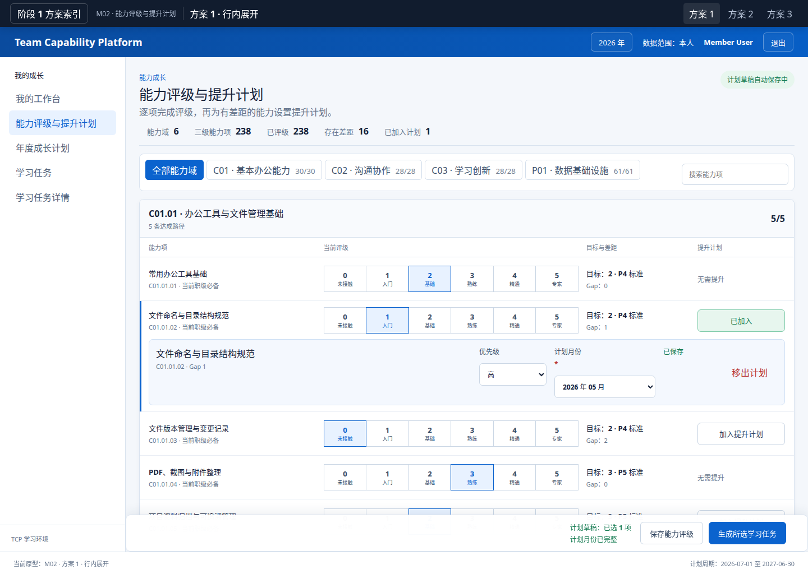
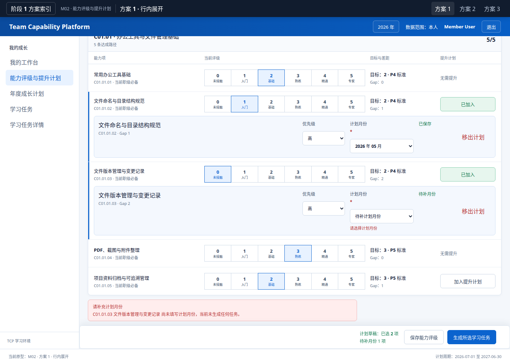
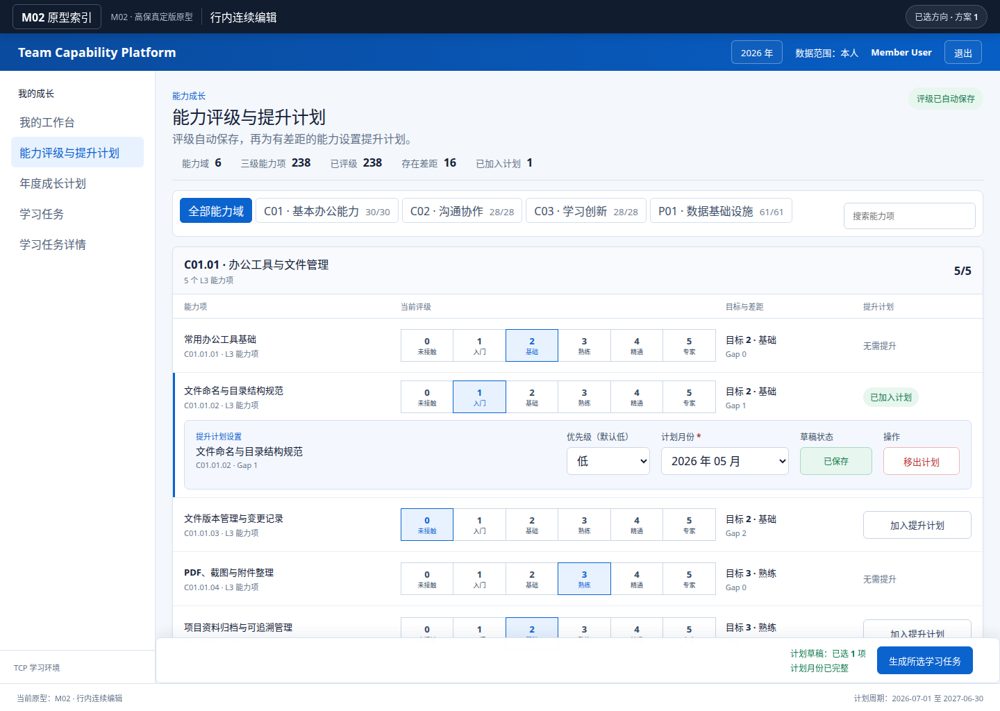
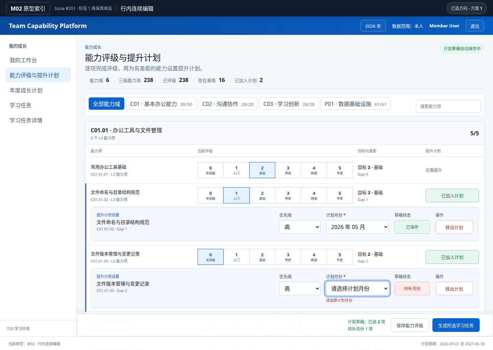

# Issue #201 · M02 方案 1 专业 UI Skills 审计

## 结论

上一版不应判为高保真通过。当前审计确认 1 个 P1 和 3 个 P2；均已在方案 1 高保真原型中修复。唯一推荐入口是 [`../prototype-v1/pages/m02-selected.html`](../prototype-v1/pages/m02-selected.html)；方案 2、3 已停止维护，旧地址统一返回该入口。

## 审计步骤

1. **默认桌面状态——需修复**

   

   P1：计划月份比优先级下沉 22px；草稿状态与移出操作没有共享字段基线。
2. **缺月份并尝试生成——部分健康**

   

   错误能阻断生成并保留输入，但字段错位在错误态更明显，焦点与错误文本也未显式关联。
3. **768px 默认状态——健康但证据不足**

   

   无横向溢出；选中项编辑区位于首屏以下，需补充实际交互与焦点检查，不能仅凭截图判定通过。
4. **高保真桌面状态——通过**

   

   标签、控件、状态、操作共享稳定网格；行内编辑与当前能力项保持空间连续。
5. **高保真错误状态——通过**

   

   缺失月份就近提示、整批阻断并聚焦对应字段；状态不只依赖颜色表达。

## 发现与修复

- **P1 · 表单轨道错位**：必填星号作为 `<label>` 的独立 Grid 子项，导致月份选择框下沉 22px。已改为明确的标签行、40px 控件行和反馈行；桌面四列同基线，窄屏按两行成对对齐。
- **P2 · 选定方向仍显示弃选入口**：顶部和索引仍展示三个方案。已只保留“已选方向 · 方案 1”，方案 2、3 URL 返回方案 1。
- **P2 · 产品合同文案漂移**：上一版显示“当前职级必备”“P4/P5 标准”，与 `docs/04_UI.md` 的 M02 不展示职级要求冲突。已改为 L3 标识、目标等级名称和 Gap。
- **P2 · 1024px 操作条遮挡**：粘性操作条覆盖选中行编辑区。已在 1180px 及以下回归普通文档流。

## Skills 复核结果

- **ui-ux-pro-max**：采用 4/8px 节奏、显式标签、就近错误、可见焦点、无水平溢出；未添加依赖或装饰图标。
- **Product Design**：以当前截图为证据审计；连续行为、信息层级和选定方向均可从页面本身理解。
- **frontend-skill**：保持工具型页面克制、单一蓝色强调、主工作区优先；没有增加卡片拼贴或装饰动效。
- **frontend-design**：唯一识别元素为“选中行蓝色导轨 + 行内计划编辑轨”，其余沿用 TCP 既有视觉系统。
- **frontend-dev**：纯 CSS 反馈和轻量按压状态；保留空态、错误态、成功态、减少动画支持，不引入媒体或第三方依赖。

## 可见证据之外的限制

截图不能独立证明键盘顺序、焦点转移、ARIA 关系或错误后的数据零写入。本轮仅对静态原型验证了前 3 项；真实后端零写入仍属于后续开发与阶段 6 证据，不在本次阶段 1 原型结论内。
